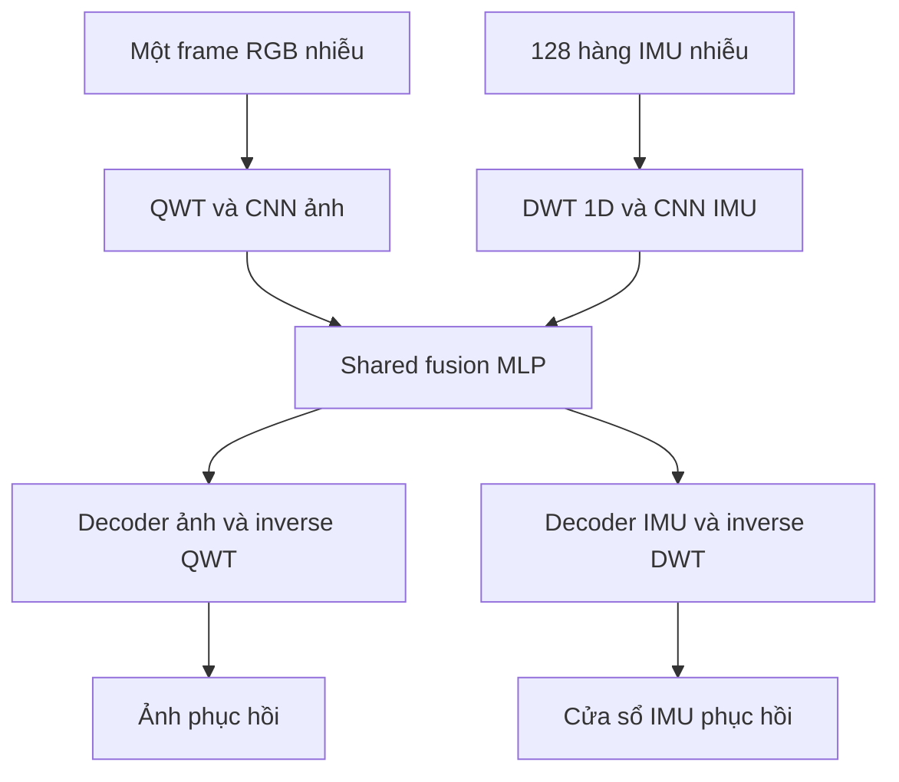

# Đặc tả QWT–JEPA: một ảnh RGB 256×256 và IMU 128×6 trên TartanAir

Phiên bản 3.0 — ngày 14/09/2026. Tài liệu đầy đủ để Agent lập trình triển khai và kiểm chứng dự án.

> **Cấu hình đã chốt:** mỗi sample có **một frame RGB 256×256** và **128 hàng IMU × 6 cột đo** theo thứ tự `ax, ay, az, gx, gy, gz`. Tổng IMU là 768 số đo; timestamp lưu riêng. Model phục hồi chính ảnh đầu vào và toàn bộ cửa sổ IMU. Không dùng frame trước/sau.

> **Tensor nội bộ:** ảnh `[B,3,256,256]`; IMU đọc từ `[128,6]`, batch và transpose thành `[B,6,128]` trước CNN1D. Đầu ra tương ứng `[B,3,256,256]` và `[B,6,128]`; export dữ liệu IMU về `[128,6]` theo timestamp.

> **Kiến trúc:** QWT 2D cho ảnh + DWT Haar 1D cho IMU → hai encoder CNN riêng → shared gated MLP fusion → hai decoder và inverse wavelet. Thêm hai predictor latent và hai target encoder EMA để học JEPA. Một model chung, một checkpoint inference; không bắt buộc Transformer/attention.

> **Shuffle:** chia train/validation/test theo trajectory trước; ghép ảnh–IMU bằng timestamp; shuffle **các cặp đã ghép** khi train. Không shuffle 128 hàng trong cửa sổ và không nối cuối một trajectory với đầu trajectory khác.

> **Dữ liệu nhiều môi trường:** người dùng mô tả khoảng 1.200 hàng IMU **mỗi P/trajectory**, không phải toàn bộ dataset. Số hàng và số trajectory phải đếm thực tế. Camera 10 Hz, IMU 100 Hz vẫn là giả định cần xác minh; nếu đúng thì 128 hàng dài **1,27 giây**.

Đây là đặc tả thiết kế, chưa phải mô hình đã huấn luyện thực nghiệm. Agent phải chạy các gate và báo bằng chứng về gradient, khả năng học và held-out metrics; không hứa trước hội tụ hoặc vượt baseline. Cụm “67 cột” trong yêu cầu được hiểu là lỗi gõ, theo kích thước rõ ràng **128×6**; nếu file nguồn có bảy cột, phải xác minh/tách timestamp trước khi vào model.

## 0. Chỉ dẫn và quyết định đã chốt

1. Đọc toàn bộ tài liệu, `AGENTS.md`, Git status và pipeline có sẵn trước khi sửa repository. Giữ công việc không liên quan, tái sử dụng phần đúng.
2. Triển khai và chạy các gate mục 17; không chỉ trả lại một bản kế hoạch. Nếu thiếu dữ liệu/GPU/dependency, hoàn thành phần có thể chạy, ghi rõ NOT_RUN và blocker.
3. **Bản 3.0 dùng đúng một frame và 128 hàng IMU theo yêu cầu mới:** input ảnh là tensor 4 chiều `[B,3,H,W]`; chỉ số 3 là RGB, không phải thời gian. Không tạo axis K hoặc sao chép một ảnh thành nhiều frame.
4. Dùng QWT với nghĩa **Quaternion Wavelet Transform**, hướng dual-tree 2D cho ảnh. QWT không tự fusion hai modality. Nếu repo dùng nghĩa khác, audit trước khi thay backend.
5. IMU dùng DWT Haar 1D theo thời gian từng kênh. Không áp QWT ảnh lên ma trận thời gian × trục cảm biến và không đổi tên Haar/DTCWT thành QWT.
6. CNN2D ảnh + CNN1D IMU + shared gated MLP là kiến trúc chính. Không bắt buộc Transformer, attention, optical flow, pose supervision hoặc pretrained foundation model.
7. Đầu ra là dữ liệu phục hồi thực, không chỉ embedding: cần decoder và inverse differentiable bên cạnh mục tiêu JEPA.
8. **L=128 là cấu hình chính đã chốt.** Audit xác minh đủ hàng liên tục, timestamp và đơn vị; không tự đổi L về256, tăng/giảm L theo từng sample hay pad hàng giả. Số hàng khoảng 1.200 là mô tả mỗi trajectory; không suy ra tần suất từ row count và không coi đó là tổng toàn dataset.
9. Không bỏ nhánh IMU/JEPA/QWT âm thầm rồi báo hoàn thành. Baseline kỹ thuật được phép, có tên và trạng thái rõ.
10. Các thông số còn lại là mặc định để pilot; resolve theo dữ liệu thực, ghi vào `resolved_config.yaml`. Không tự tạo metric/checkpoint huấn luyện giả.

## 1. Bài toán và giới hạn của một frame

Mỗi sample gồm ảnh tham chiếu `I_clean` tại timestamp `t_image` và 128 hàng IMU tham chiếu liên tiếp quanh timestamp đó. Sáu kênh dự kiến `[ax,ay,az,gx,gy,gz]` phải được xác minh từ dữ liệu.

```text
I_bad = C_image(I_clean; image_rng)
U_bad = C_imu(U_clean; imu_rng)
I_hat, U_hat = model(I_bad, U_bad, t_image, t_imu_window)
```

- Clean ở đây là dữ liệu tham chiếu trước khi thêm corruption nhân tạo; phải kiểm tra file IMU thực có phải bản reference.
- Camera mờ/nhiễu do chất lượng thấp; IMU có lỗi đo độc lập. Không buộc blur phụ thuộc gyro hay IMU spike tạo camera shake.
- Nhiễu độc lập không làm các tín hiệu sạch mất quan hệ vật lý. Tuy nhiên **một ảnh đơn không quan sát trực tiếp chuyển động giữa các frame**, nên lợi ích fusion ảnh–IMU cho khử nhiễu chưa được bảo đảm.
- Mỗi nhánh giữ dense features và skips riêng để vẫn phục hồi được khi nguồn kia ít hữu ích. Phải đo cross-modal fusion bằng ablation.
- Một ảnh đơn không đủ giúp suy ra mọi bias/drift IMU hoặc tái tạo chi tiết quang học đã mất. Không tối ưu “nét/mượt” bằng cách xóa chuyển động hay thêm chi tiết giả.
- JEPA là cơ chế học dự đoán đặc trưng; CNN/MLP là các module hiện thực. Đây là **hybrid restoration có target sạch**, không phải I-JEPA nguyên gốc hoặc hoàn toàn self-supervised. I-JEPA gốc học đặc trưng vùng ảnh qua dự đoán latent; thiết kế này dùng noisy-to-clean latent prediction. [I-JEPA](https://arxiv.org/abs/2301.08243)
- Clean chỉ vào teacher/loss. Online/inference không được đọc ảnh khác, IMU sạch, pose GT, corruption severity thật hoặc trajectory label như feature.
- Cấu hình mặc định **centered offline**: tuy chỉ có một ảnh, cửa sổ IMU vẫn dùng mẫu sau timestamp ảnh. Không gọi đây là inference nhân quả. Muốn causal phải đổi window policy, train/đánh giá lại và công bố latency.

## 2. Hợp đồng IMU 128×6 và dữ liệu nhiều môi trường

### 2.1 Sáu cột đo, timestamp riêng

| Cột canonical | Đại lượng | Đơn vị sau khi loader chuyển đổi |
| --- | --- | --- |
| ax | Gia tốc trục x | m/s² |
| ay | Gia tốc trục y | m/s² |
| az | Gia tốc trục z | m/s² |
| gx | Vận tốc góc quanh x | rad/s |
| gy | Vận tốc góc quanh y | rad/s |
| gz | Vận tốc góc quanh z | rad/s |

`gx,gy,gz` có thể được dataset gọi `wx,wy,wz`; xác minh schema rồi ánh xạ đúng. Không coi ba cột ax/ay/az là đủ IMU sáu kênh, không tự tạo ba cột gyro bằng zero để lấp thiếu dữ liệu.

- Một window storage: `U[128,6]`, rows tăng theo thời gian; 128×6=768 giá trị đo.
- Nếu file là `[N,7]` gồm time+6 kênh, tách time thành `timestamps[N]`; không đưa time vào kênh đo thứ bảy.
- Nếu accel/gyro nằm riêng `[N,3]`, ghép theo timestamp/schema; không ghép theo row index khi chưa xác minh đồng bộ.
- Không flatten rồi reshape(-1,6) một mảng không rõ schema. Nếu chỉ có ax/ay/az phải tìm gyro thật; ghi blocker cho nhiệm vụ sáu kênh nếu không có.
- 128 là số mẫu thời gian, không phải Hz, số features hay độ phân giải ảnh. L=128 không cần bằng256 của ảnh.

### 2.2 Môi trường, trajectory P… và tổng dữ liệu

TartanAir tổ chức lựa chọn dữ liệu theo environment, difficulty và trajectory ID như P000/P001. Các thư mục P… là các trajectory riêng; không mặc định mọi môi trường đều có đúng P1–P5. [Ví dụ chính thức TartanAir](https://tartanair.org/examples.html)

Người dùng đang nói khoảng 1.200 hàng **trong mỗi P**, và có nhiều P ở nhiều môi trường. Vì vậy:

- Đếm `N_IMU` cho từng `(environment,difficulty,trajectory_id)`; không hard-code N=1200 hay số P=5.
- Tổng rows là tổng các timeline thật. Không cộng lại cùng timestamp IMU chỉ vì có nhiều camera hoặc nhiều window overlap.
- Ví dụ minh họa, nếu có 20 môi trường ×5 trajectory ×1200 rows thì tổng khoảng 120.000 rows. Đây không phải số liệu đã audit của người dùng.
- Cửa sổ128 hàng phải nằm trong một trajectory. Không nối dữ liệu cuối P1 và đầu P2 để đủ128.
- Có thể train một model trên tất cả training trajectories qua sample manifest, không cần một model cho mỗi P.
- Giữ một số trajectory hoàn toàn chưa thấy để validation/test. Có thể thêm test environment chưa thấy nếu đủ dữ liệu; báo rõ hai protocol khác nhau.

Một P có 1200 rows đủ để cắt128 hàng về mặt cấu trúc. Nó có tối đa `1200-128+1=1073` vị trí bắt đầu nếu trượt một hàng, nhưng đó là **window ứng viên chồng lấn**, không phải1073 sample ảnh–IMU độc lập. Số sample thực phụ thuộc timestamp các frame và window support.

### 2.3 Tần suất và thời lượng cửa sổ

Camera10 Hz và IMU 100 Hz là thông tin người dùng đang phỏng đoán. Agent phải tính từ timestamp hoặc metadata có nguồn, không đặt mặc định ngầm.

```text
dt = median(diff(imu_timestamps_seconds))
f_imu = 1 / dt
T_window = timestamp[s+127] - timestamp[s]
# Với lấy mẫu đều: T_window = 127 / f_imu
```

| f_IMU — ví dụ | Thời lượng128 hàng |
| --- | ---: |
| 100 Hz | 1,27 s |
| 200 Hz | 0,635 s |
| 1.000 Hz | 0,127 s |

Nếu camera đúng 10 Hz và IMU đúng 100 Hz:

- Hai frame cách nhau khoảng 0,1 s; có khoảng 10 bước/mẫu IMU giữa hai frame theo khoảng nửa mở. Nếu tính cả hai endpoint có thể đếm11 hàng; phải thống nhất convention.
- Window128 hàng trải127 khoảng dt, dài 1,27 s. Centered window nhìn khoảng 0,635 s mỗi phía của ảnh, không phải cửa sổ10 hàng giữa hai frame.
- Hai ảnh kế tiếp thường dịch window khoảng 10 hàng; overlap `(128-10)/128=92,1875%`. Shuffle sample không biến các window overlap thành quan sát độc lập.
- Một P có 1200 hàng ở100 Hz dài 11,99 s. Nếu camera 10 Hz phủ cùng khoảng bắt đầu từ0 thì có khoảng 120 ảnh; ví dụ timestamps đều có 107 ảnh còn đủ centered context sau loại biên. Số thực phụ thuộc offset/gaps/coverage, phải tính bằng manifest.

Nhiệm vụ này khử nhiễu một cửa sổ IMU quanh một ảnh; không bắt buộc L bằng số IMU samples giữa hai frame. **Giữ L=128 theo yêu cầu**, audit xem duration phù hợp và đo kết quả. Việc có 1.200 hàng/P không yêu cầu đưa cả1.200 hàng vào một lần forward.

TartanAir có IMU tham chiếu sinh từ pose và hỗ trợ tùy chỉnh việc sinh dữ liệu; tài liệu này không thay thế audit phiên bản/file người dùng. [TartanAir modalities](https://tartanair.org/modalities.html)

### 2.4 Audit bắt buộc trước triển khai

Agent tạo `DATA_AUDIT.md`:

1. Version, environment/difficulty/P/camera thật; số ảnh và IMU rows từng trajectory, tổng duration và split inventory.
2. Shape, dtype, schema/units, RGB/BGR; clean/reference IMU hay file đã nhiễu.
3. Timestamps s/ms/µs/ns được đổi đúng về giây; `len(t)==N`, monotonic, NaN/Inf, duplicate rows/gaps, rate trung vị và phân bố dt.
4. Cách đồng bộ accel/gyro và ảnh; conventions gravity/specific-force, axes, camera–IMU/extrinsics. Không tự bỏ gravity hoặc vi phân pose thô để tạo target giả.
5. Số frame đủ centered window128, center-time error, coverage IMU, phần biên bị loại, độ dài window thực.
6. Stats normalization trên unique train-clean timestamps, không đếm overlap hoặc camera duplicates.
7. Repo/AGENTS.md, checkpoints, Python/PyTorch/CUDA/dependencies, GPU/VRAM/RAM/disk; đo pilot trước train dài.
8. QWT analysis/synthesis, layout/filter/backend/license/revision, round-trip và gradient; DWT1D thật cho IMU.

Nếu N<128 hoặc có gap làm window không hợp lệ, loại sample/trajectory tương ứng và báo số lượng, tìm dữ liệu liên tục khác. Không repeat, zero-pad hay đổi L âm thầm. Nếu không còn đủ sample, báo blocker cụ thể và tiếp tục tests tổng hợp có nhãn.

Đoạn audit sau chỉ chạy **sau khi đã xác minh canonical schema `u[N,6]`, `t[N]` theo giây**:

```python
import numpy as np

def audit_canonical_imu(u, t, L=128):
    u, t = np.asarray(u), np.asarray(t, dtype=np.float64)
    assert u.ndim == 2 and u.shape[1] == 6
    assert t.ndim == 1 and len(t) == len(u) and len(t) >= 2
    assert np.isfinite(u).all() and np.isfinite(t).all()
    dt = np.diff(t)
    assert (dt > 0).all(), 'Timestamp phải tăng nghiêm ngặt'
    med = np.median(dt)
    return {
        'rows': len(u), 'measurement_scalars': int(u.size),
        'duration_s': float(t[-1]-t[0]), 'median_rate_hz': float(1/med),
        'max_relative_dt_deviation': float(np.max(np.abs(dt-med))/med),
        'window_rows': L, 'enough_rows': len(u) >= L,
        'uniform_window_duration_s': float((L-1)*med),
        'candidate_windows_stride_1': max(0, len(u)-L+1),
    }
```

Đây là helper audit, không phải parser TartanAir hoàn chỉnh. Thiếu timestamp chỉ được suy ra từ metadata rate đáng tin; ghi giả định. Không xác minh được pairing thì chưa được train fusion dữ liệu thật; không tạo frame/IMU giả rồi báo dữ liệu TartanAir.

## 3. Tạo sample và shuffle dữ liệu liên tục

### 3.1 Đơn vị huấn luyện

Một sample là `(một frame tại t_image, một cửa sổ IMU L hàng quanh t_image)`. Mỗi batch gồm nhiều sample. Model không duy trì RNN state hoặc memory giữa batch; quan hệ thời gian cần cho IMU nằm trong window.

| Thao tác | Quy tắc |
| --- | --- |
| Chia train/validation/test | Theo trajectory trước khi cắt window |
| Ghép ảnh–IMU | Theo timestamp/camera/trajectory |
| Thứ tự sample khi train | Shuffle các cặp đã ghép |
| Thứ tự hàng IMU trong sample | Giữ đúng thời gian |
| Thứ tự sáu kênh IMU | Giữ đúng schema |
| Validation/test/inference trajectory | Theo timestamp hoặc sắp xếp về timestamp trước merge |

Ví dụ: có `(I_10,U_window_10)`, `(I_11,U_window_11)`, `(I_12,U_window_12)`. Batch có thể lấy cặp thứ ba trước cặp thứ nhất. Không đổi thành `(I_10,U_window_12)` và không đảo hàng bên trong `U_window_10`.

**Có thể shuffle frame dưới dạng sample đã ghép**, vì mỗi sample chỉ chứa một frame. Không cần giữ toàn bộ thứ tự ảnh trong train nếu không có hidden state xuyên sample. Shuffle giúp tránh batch toàn frame gần giống nhau, nhưng không loại tương quan của dữ liệu overlap và không thay thế split đúng.

### 3.2 Split và manifest

- Chia theo trajectory (mặc định mục tiêu 80/10/10 nếu đủ trajectory); mọi camera của cùng chuyển động thuộc cùng split. ID đầy đủ gồm environment/difficulty/trajectory nếu tên P000 lặp.
- Baseline chọn một camera đã xác minh tương ứng IMU. Không nhân đôi cùng IMU qua nhiều camera rồi đếm như sample độc lập.
- Không random-split frame/window của cùng trajectory vào train và test. Nếu chỉ có một trajectory, có thể debug bằng time split kèm guard gap lớn hơn window support và loại sample vượt biên; ghi rõ chưa có đánh giá độc lập trajectory.
- Nếu ít hơn ba trajectory, không tự báo split 80/10/10 hợp lệ. Ghi số lượng thực và giới hạn; không tạo test bằng cách copy dữ liệu.
- Manifest: `sample_id`, split, environment/trajectory/camera, image path, `t_image`, `imu_start`, `imu_end_exclusive`, timestamps, units/version và normalization source hash.
- Stats IMU chỉ tính trên unique train timestamps; không đếm lại qua overlapping windows. Split hash lưu trong checkpoint.

### 3.3 Cắt window centered đúng timestamp

Giả sử đã có timeline liên tục `u[N,6]`, `t[N]` theo giây, t tăng; L cố định cho run:

1. Xác nhận N>=L. Với mọi start s trong `[0,N-L]`, center time `c[s]=(t[s]+t[s+L-1])/2`.
2. Với frame timestamp `t_image`, dùng searchsorted trên c, so hai candidate gần nhất và chọn start có `abs(c[s]-t_image)` nhỏ nhất. Cách này xử lý L chẵn mà không giả định một hàng ở chính giữa.
3. Loại sample nếu `t_image` ngoài `[c[0],c[-1]]` (không tự dịch window về biên để giữ frame thiếu ngữ cảnh).
4. Yêu cầu `t[s] <= t_image <= t[s+L-1]` và center error <= một median IMU dt. Nếu không đạt, báo pairing/gap issue thay vì ghép cưỡng ép.
5. Window không qua trajectory, split boundary hoặc gap. Baseline near-uniform: `max(abs(dt_window-median_dt))/median_dt <= 0.01`; kiểm tra gaps trên trajectory trước khi tạo candidates.
6. Nếu không đều, chỉ resample theo pipeline được audit, cùng lưới clean/noisy, antialias khi giảm rate; không ép đủ L bằng nội suy mà chưa định nghĩa lại rate/time span.
7. Cắt `u[s:s+L]`, lưu indices và timestamp. Không reshape cả file 1.200 hàng thành nhiều block 128 rồi bỏ tùy ý phần còn lại; pairing dựa trên ảnh, không theo vị trí chia block.

L=128 cố định cho cấu hình chính; số rows của mỗi trajectory có thể là1.200,10.000 hoặc khác. Encoder dùng Haar1D và ba lần downsample nên output IMU dài 128/16=8. Nếu làm ablation L khác sau này, dùng config/run riêng và kiểm chứng lại; không tự đổi L khi đọc sample hoặc padding dữ liệu giả.

### 3.4 Coverage và overlap

Nếu IMU window quá ngắn so với khoảng cách giữa các frame, các window có thể để hở timeline. Trước run, tính coverage IMU ở tập đánh giá. Không hứa phục hồi toàn timeline khi chỉ dự đoán vùng quanh ảnh; muốn phủ đầy phải thiết kế sampling khác và đánh giá lại, không kéo timestamp ảnh để lấp chỗ trống.

Nếu một P có 1.200 rows và L=128, windows overlap mạnh; không dùng1073 candidate windows để suy luận có 1073 quan sát độc lập. Tổng dataset gồm nhiều P phải được thống kê riêng. Mỗi image timestamp chỉ tạo một sample mặc định; số sample hợp lệ bị giới hạn bởi số frame và window support.

### 3.5 RNG và loader

- Tạo pairs/manifest trước, train shuffle sample indices theo seed mỗi epoch. Mặc định mỗi sample một lần/epoch; có thể batch trộn trajectory nếu nhiều dữ liệu.
- `shuffle=true` cho train; validation/test không shuffle để thuận tiện merge. Với DDP dùng sampler phù hợp, gọi `set_epoch`, xử lý padding duplicates khi metric.
- Tách RNG sampler/image/IMU. Validation/test corruption cố định. Train noise realization có thể đổi theo epoch.
- Noise IMU được sinh liên tục theo trajectory/realization rồi slice; cùng row trong hai windows có cùng noise. Ảnh seed theo frame/segment, không theo batch order.
- Không tạo biến batch từ frame indices rồi shuffle riêng IMU. Không mang trạng thái từ sample trước vào sample sau.

## 4. Tensor input/output, chuẩn hóa và thời gian

### 4.1 Hợp đồng công khai

| Tensor | Shape mặc định | Ý nghĩa |
| --- | --- | --- |
| `image_bad` / `image_clean` | `[B,3,256,256]` | Một frame RGB mỗi sample; clean chỉ train/eval |
| `imu_bad_phys` / `imu_clean_phys` | `[B,6,128]` | Sáu channels, 128 hàng thời gian sau transpose |
| `image_time` | `[B]` | Một timestamp theo giây mỗi frame |
| `imu_times` | `[B,128]` | Timestamp từng mẫu IMU |
| `image_hat` | `[B,3,256,256]` | Chính frame đầu vào được phục hồi |
| `imu_hat_phys` | `[B,6,128]` | Cửa sổ IMU phục hồi, units vật lý |

Loader đọc canonical IMU `[N,6]`, cắt `[128,6]` rồi transpose thành `[6,128]` khi batch. Timestamp lưu riêng, không thêm vào kênh đo thứ bảy. Cấu hình chính bắt buộc128 hàng và6 kênh đo. Dataset có thể trả raw `[128,6]`; model core nhận channels-first `[B,6,128]`. Export transpose IMU về `[128,6]` cho từng cửa sổ. Không nhầm output feature dimension128 với128 hàng thời gian.

### 4.2 Ảnh RGB

- RGB float32 `[0,1]`; nếu OpenCV decode BGR phải đổi đúng một lần.
- Nguồn đã 256×256 thì giữ nguyên. Nếu khác, resize giữ aspect ratio để cạnh ngắn bằng 256 rồi center-crop 256×256, lưu scale/crop; antialias khi giảm độ phân giải.
- Target là ảnh sau chuẩn hóa hình học; tạo corruption sau resize/crop. Blur sigma tính bằng pixel trên 256×256.
- Không có input frame trước/sau. Không thêm axis K=1 trong API public; ba channels là R,G,B.
- Baseline tắt random flip/rotation/crop để giữ pairing/hình học. Nếu mở rộng sau, phải xử lý camera/IMU conventions đúng.
- Backbone train từ đầu; không tự áp ImageNet normalization.

### 4.3 IMU

- Units canonical: accel m/s², gyro rad/s; thứ tự `[ax,ay,az,gx,gy,gz]`.
- Corruption trong units vật lý; sau đó normalize input và target bằng mu/scale cố định theo từng kênh, tính **chỉ trên train clean unique timestamps**.
- `U_norm[c,k]=(U_phys[c,k]-mu[c])/scale[c]` và inverse `U_phys=U_norm*scale+mu`.
- `scale=max(train_std,floor)`, floor khởi đầu accel 1e-3 m/s², gyro 1e-4 rad/s; log trục gần hằng số. Floor là ổn định số, không noise severity.
- Không normalize riêng từng window vì có thể che bias. Không bỏ gravity/làm mượt target/đổi hệ trục nếu chưa xác minh.
- Mu/scale là buffers không train, mang theo checkpoint/export. Metric IMU phải inverse normalization.

### 4.4 Metadata thời gian dùng cho fusion

Timestamp tuyệt đối float64 khi pairing; metadata tương đối cast float32 vào mạng:

```text
T = imu_times[-1] - imu_times[0]                 # >0
m = [
  (image_time - (imu_times[0]+imu_times[-1])/2) / T,
  log(T / 1.0 second),
  log(median(diff(imu_times)) / 0.01 second)
]                                               # [B,3]
```

Không còn vector vị trí ba frame hay temporal image metadata. Shared fusion nhận 128+128+3=**259** chiều ở đầu vào MLP. Units của tỷ số trong log phải không thứ nguyên. Reject timestamp lỗi thay vì giấu bằng epsilon.

## 5. Sinh suy giảm ảnh và IMU độc lập

### 5.1 Các RNG stream

Seed suy ra bằng SHA-256 hoặc hàm hash ổn định từ `(master_seed, split, realization, trajectory, modality, frame_or_segment)`. Không dùng Python `hash()` mặc định.

- Train thay realization theo epoch; validation/test không chứa epoch trong seed.
- Model nhận dữ liệu bad; severity/clean flags chỉ phục vụ sinh dữ liệu và phân nhóm báo cáo.
- Khởi đầu mỗi modality có xác suất giữ sạch 0.1, lấy mẫu **độc lập** theo đoạn liên tục của từng cảm biến. Với sampling cân bằng, clean/clean kỳ vọng 1%, một nguồn hỏng 9% mỗi loại, cả hai hỏng 81%; báo tỷ lệ thực tế.
- Cho ảnh, optical parameters/clean flag cố định theo đoạn camera 1 giây ở baseline; noise realization riêng từng frame/pixel. Segment dựa vào timestamp tương đối từ đầu trajectory; dùng cùng realization cho một frame nếu sample đó được đọc lại trong cùng epoch/realization.
- Cho IMU, clean flag/severity/bias trajectory-level trong mỗi realization để giữ continuity; ảnh không dùng những lựa chọn này. Nếu muốn segment-level IMU sau này, phải định nghĩa chuyển tiếp bias liên tục.
- Unit test kiểm tra tham số nhiễu hai nguồn không được gắn bằng một severity scalar chung. Độc lập tham số không đòi sai số đầu ra có tương quan bằng 0, vì nội dung dữ liệu vẫn liên quan.

### 5.2 Corruption ảnh

Thứ tự: clean 256×256 → Gaussian blur → downsample/upsample tùy chọn → Gaussian noise → clip `[0,1]`. JPEG tắt mặc định.

| Tham số | Giai đoạn nhẹ A/B | Giai đoạn khó C |
| --- | --- | --- |
| Blur sigma (pixel) | Uniform(0.3,1.0) | Uniform(0.3,2.0) |
| Noise std trên `[0,1]` | Uniform(2/255,8/255) | Uniform(0,15/255) |
| Downsample probability | 0 | 0.3 |
| Downsample scale | 1 | Uniform(0.5,1.0) |
| JPEG probability | 0 | 0, chỉ ablation riêng |

Kernel blur `2*ceil(3*sigma)+1`, sigma=0 là identity; dùng reflect padding có kiểm tra. Downsample kích thước `round(256*scale)` rồi upsample về 256, lưu interpolation/antialias. Các frame dùng optical parameter theo segment, noise theo frame; không tạo blur phụ thuộc tốc độ quay.

Mô hình suy giảm này là xấp xỉ để nghiên cứu, chưa là calibration camera thật. Không tuyên bố nó mô phỏng đầy đủ shot/read noise hoặc rolling shutter.

### 5.3 Corruption IMU

Trong đơn vị vật lý cho từng trục:

```text
u_bad[k] = u_clean[k] + b[k] + sigma_sample * eps[k] + spike[k]
b[0] ~ Uniform(-bias_bound, +bias_bound)
b[k+1] = b[k] + q_bias * sqrt(dt[k]) * eta[k]
```

`eps, eta` là Gaussian chuẩn độc lập. `sigma_sample` là std **mỗi mẫu**; `q_bias` có đơn vị đo/√s. Phân biệt với noise density; nếu thêm mode density, dùng quy ước và phép quy đổi được tài liệu hóa, không cộng cả hai mode. [Kalibr IMU Noise Model](https://github.com/ethz-asl/kalibr/wiki/IMU-Noise-Model)

| Tham số | Accel | Gyro | Mặc định A/B |
| --- | --- | --- | --- |
| sigma_sample | Uniform(0.02,0.10) m/s² | Uniform(0.001,0.005) rad/s | Bật |
| bias_bound | 0.05 m/s² | 0.003 rad/s | Tắt |
| q_bias | 0.005 (m/s²)/√s | 0.0002 (rad/s)/√s | Tắt |
| Spike amplitude | Uniform(0.5,2.0) m/s² | Uniform(0.02,0.10) rad/s | Tắt |

Stage C lần lượt bật bias, drift rồi spike nếu cần. Bốc `sigma_sample` riêng từng trục theo trajectory/realization. Spike: rate 0.2 sự kiện/s mỗi sensor triplet; tại mỗi mẫu xác suất `1-exp(-rate*dt)`, chọn một trục và dấu, độ dài một mẫu; amplitude **độc lập** sigma_sample.

Sinh trace lỗi liên tục cả trajectory/realization (có thể cache CPU nhỏ), rồi cắt window. Không reset random walk ở đầu mỗi cửa sổ overlap. Bias/drift tăng theo thời lượng trajectory phải được log; không tự clamp để làm dễ nhiệm vụ.

Các mức trên là mức thử tổng hợp, chưa phải thông số của một IMU giá rẻ cụ thể. Khi overfit minibatch, khóa crop, noise và trace; clone dữ liệu trước corruption để không mutate clean.

## 6. Hợp đồng wavelet: QWT thật cho ảnh, DWT 1D cho IMU

### 6.1 API chung

```python
coeffs, layout = transform.analysis(x)
x_reconstructed = transform.synthesis(coeffs, layout)
```

`layout` chứa original shape, padding, boundary mode, level, band/component order, filter/backend identifier và scale convention. Coefficients là số thực có dấu, có thể âm; không chỉ giữ magnitude, không bỏ lowpass/highpass/phase information cần cho inverse.

Transform cố định được lưu như buffers, không thuộc optimizer. Analysis và synthesis chạy FP32 ở phiên bản đầu, cùng device với tensor. Đường synthesis phải differentiable về coefficients dự đoán: không `.detach()`, NumPy, PIL hoặc CPU round-trip trong đường loss → decoder.

### 6.2 QWT ảnh một level

Thiết kế mong muốn là dual-tree quaternion wavelet 2D, áp dụng riêng cho từng kênh RGB. Một cách biểu diễn có bốn nhóm quaternion, mỗi nhóm bốn thành phần thực; với RGB có thể pack thành 48 kênh thực. Đây là **layout của họ biến đổi được chọn**, không phải mọi thư viện có tên QWT đều trả cùng shape. [QUAVE, phần III-B](https://arxiv.org/html/2310.10224v3#S3.SS2)

Hợp đồng logic cho adapter mục tiêu:

```text
input:        [B, 3, 256, 256]
structured:   [B, 3, 4, 4, Hc, Wc]
axes:         batch, RGB, band_group, quaternion_component, height, width
packed:       [B, 48, Hc, Wc]
```

`band_group` theo thứ tự canonical `[approx, detail_1, detail_2, detail_3]`; adapter phải ghi orientation chính xác của các detail theo backend, không đoán tên LH/HL khi thư viện dùng convention khác. `component` canonical `[real, i, j, k]` phải có mapping kiểm chứng tới hệ số nguồn. Pack thứ tự `channel = ((rgb*4)+band)*4+component`.

- Layout tham chiếu cho bảng network là `Hc=Wc=128`. Filter dài và boundary mode khác có thể trả lớn hơn; đọc shape thực tế từ adapter. Không crop/interpolate coefficients để ép 128 rồi tuyên bố inverse chính xác.
- CNN/decoder phải hỗ trợ kích thước lưới thực bằng skip-shape và interpolation-to-size. Lưới feature cuối không hard-code 16 nếu backend trả Hc khác 128.
- RGB được xử lý riêng trong analysis, rồi CNN trộn channels. Không biến RGB thành một quaternion màu bằng quy tắc tự nghĩ ra rồi giả định đó là cùng QWT.
- Không gọi ghép `LL,LH,HL,HH` của DWT thường thành bốn phần quaternion là implementation tương đương dual-tree QWT. Không gọi DTCWT là QWT nếu chưa có chuyển đổi và nguồn lý thuyết rõ.
- Nếu backend dùng normalization năng lượng khác, giữ nguyên cặp analysis/synthesis và ghi quy ước; không thay scale một phía.
- Với redundant transform, hệ số decoder tạo ra có thể không nằm hoàn toàn trong range của analysis. Synthesis vẫn phải được định nghĩa; không yêu cầu `analysis(synthesis(c))==c` cho mọi c tùy ý. Gate bắt buộc là round-trip trên **dữ liệu đầu vào** và gradient inverse.

Agent tìm/reuse implementation có provenance; [repository QUAVE/QWT](https://github.com/ispamm/QWT) là điểm tham khảo cần audit, **không phải bảo đảm inverse/backend tương thích**. Ghi filter coefficients, sampling, boundary handling, reconstruction scaling và code revision trong `QWT_AUDIT.md`. Các khẳng định gần bất biến dịch không thay thế gate số học.

### 6.3 Nếu QWT chưa qua kiểm chứng

Được tạo cấu hình **riêng** `image_transform=dwt_haar_baseline` để kiểm tra loader, CNN, fusion, JEPA, decoder và training. Haar RGB một level trả `[B,12,128,128]`.

Phải đồng thời giữ cấu hình mục tiêu `image_transform=qwt`; không tự fallback âm thầm khi load fail. Run name, checkpoint, report đều ghi transform đang chạy. Baseline Haar không hoàn thành yêu cầu QWT. Sau khi QWT đúng, tạo run mới và chạy lại transform/gradient/overfit gates; không ghép metric hai backend thành một run.

### 6.4 DWT Haar 1D cho IMU

L chẵn; với từng kênh đã chuẩn hóa:

```text
A[n] = (u[2*n] + u[2*n+1]) / sqrt(2)
D[n] = (u[2*n] - u[2*n+1]) / sqrt(2)

u[2*n]   = (A[n] + D[n]) / sqrt(2)
u[2*n+1] = (A[n] - D[n]) / sqrt(2)
```

Pack `[A_ax,A_ay,A_az,A_gx,A_gy,A_gz,D_ax,D_ay,D_az,D_gx,D_gy,D_gz]`: `[B,6,L] → [B,12,L/2]`.

Đây là **DWT 1D**, không phải QWT. Không áp QWT 2D lên ma trận `thời gian × sáu trục`: trục cảm biến không là một trục không gian liên tục. Encoder CNN1D sẽ học tương tác giữa sáu kênh. Không cộng coefficients ảnh và IMU trực tiếp chỉ vì cùng có nhãn “low/high”.

## 7. Model chung và đường thông tin

```python
JointRestorationJEPA
    image_transform             # fixed QWT 2D cho một RGB frame
    imu_transform               # fixed Haar 1D
    image_encoder               # CNN2D
    imu_encoder                 # CNN1D
    shared_fusion               # shared MLP và hai đường điều tiết
    image_predictor             # latent head cho JEPA
    imu_predictor               # latent head cho JEPA
    image_decoder               # hiệu chỉnh hệ số QWT ảnh
    imu_decoder                 # hiệu chỉnh hệ số Haar IMU
    teacher_image_encoder       # EMA image_encoder, chỉ train
    teacher_imu_encoder         # EMA imu_encoder, chỉ train
```



Ngoài sơ đồ, decoder nhận skips và noisy coefficients của chính modality. Hai predictors đọc fused features để so với clean target latents do EMA teachers sinh. Teachers không nối vào online fusion/decoder. Online modules cùng một optimizer; export một model inference.

Không gom toàn ảnh/IMU thành một vector rồi bỏ dense features. Summary chỉ dùng để trao đổi thông tin, còn encoder maps/sequences và skips giữ thông tin phục hồi cục bộ.

## 8. Encoder CNN cụ thể

### 8.1 Blocks

```text
ConvBlock_d(cin,cout,stride):
  Conv{d}d(cin,cout,kernel=3,stride=stride,padding=1,bias=False)
  GroupNorm(groups=8,channels=cout)
  SiLU

ResBlock_d(c):
  y = Conv{d}d(c,c,3,1,1,bias=False)(x)
  y = SiLU(GroupNorm(8,c)(y))
  y = Conv{d}d(c,c,3,1,1,bias=False)(y)
  return SiLU(x + GroupNorm(8,c)(y))
```

Channels 32/64/96/128 chia hết 8; không BatchNorm, dropout=0. Conv stride2 cho size `ceil(size/2)`. GroupNorm trong mạng không thay chuẩn hóa IMU theo units.

### 8.2 Encoder ảnh — một frame

| Tầng | Thao tác | Shape tham chiếu |
| --- | --- | --- |
| Input | RGB | `[B,3,256,256]` |
| Coefficients | QWT pack | `[B,48,128,128]` |
| S0 | ConvBlock2D(Ccoeff,32,1) + ResBlock2D(32) | `[B,32,128,128]` |
| S1 | ConvBlock2D(32,64,2) + ResBlock2D(64) | `[B,64,64,64]` |
| S2 | ConvBlock2D(64,96,2) + ResBlock2D(96) | `[B,96,32,32]` |
| S3 | ConvBlock2D(96,128,2) + ResBlock2D(128) | `[B,128,16,16]` |

`FI=S3`, skips S0/S1/S2. **Không temporal mixer** và không reshape batch×time. Ccoeff resolve theo adapter (QWT mục tiêu 48, Haar baseline 12). QWT boundary có thể cho Hc/Wc khác 128; encoder/decoder dùng size thực, không cắt coefficients để ép đúng bảng.

### 8.3 Encoder IMU

| Tầng | Thao tác | Shape với L=128 |
| --- | --- | --- |
| Storage mỗi sample | Hàng thời gian ×6 kênh | `[128,6]` |
| Input normalized | Sau batch/transpose | `[B,6,128]` |
| Coefficients | DWT Haar1D, low+high | `[B,12,64]` |
| V0 | ConvBlock1D(12,32,1) + ResBlock1D(32) | `[B,32,64]` |
| V1 | ConvBlock1D(32,64,2) + ResBlock1D(64) | `[B,64,32]` |
| V2 | ConvBlock1D(64,96,2) + ResBlock1D(96) | `[B,96,16]` |
| V3 | ConvBlock1D(96,128,2) + ResBlock1D(128) | `[B,128,8]` |

`FU=V3`, skips V0/V1/V2. **128 là số channels đặc trưng ở V3; 8 là chiều thời gian còn lại**, không phải model chỉ phục hồi8 hàng. Decoder upsample về hệ số64 vị trí và inverse Haar trả128 hàng.

Không ép số token IMU 8 bằng số patch ảnh256; fusion chỉ cần dimension đặc trưng tương thích. Pool4 bins trong summary lấy từ FU dài 8, giữ thứ tự thô của4 đoạn; dense FU/skips vẫn tồn tại.

## 9. Fusion ảnh–IMU bằng MLP có cổng điều tiết

### 9.1 Tạo summary riêng

```text
gI = LayerNorm128(mean_spatial(FI))                 # [B,128]
u4 = flatten(AdaptiveAvgPool1d(4)(FU))               # [B,512], giữ thứ tự bin
gU = LayerNorm128(Linear(512,128)(u4))               # [B,128]
v  = concat(gI, gU, m)                              # [B,259]
s  = LayerNorm128(Linear(256,128)(SiLU(Linear(259,256)(v))))
```

`s` là summary chung `[B,128]`. Pool bốn đoạn IMU giữ một phần thứ tự thô, nhưng không thay thế FU dense. Không claim gI và gU đã nằm cùng không gian ngữ nghĩa chỉ vì cùng 128 chiều.

### 9.2 Điều tiết dense feature riêng bằng summary chung

```text
gateI = sigmoid(Linear_I(259,128)(v))               # [B,128]
gateU = sigmoid(Linear_U(259,128)(v))               # [B,128]

dI = Conv2d_1x1(128,128)(SiLU(Conv2d_1x1(256,128)(concat(FI,broadcast(s)))))
dU = Conv1d_1x1(128,128)(SiLU(Conv1d_1x1(256,128)(concat(FU,broadcast(s)))))

FI_fused = FI + gateI[...,None,None] * dI
FU_fused = FU + gateU[...,None]      * dU
```

Tất cả layer ở mục 9 thuộc **một shared_fusion module** và optimizer chung. Linear gate khởi tạo weight=0, bias=-2, nên gate ban đầu xấp xỉ 0.119. Các delta layers khởi tạo chuẩn, không đồng thời zero mọi đường trao đổi. Gate vẫn học được, không threshold cứng.

Không diễn giải gate như xác suất “sensor đáng tin cậy” đã được calibration. Nó là trọng số đặc trưng được học từ loss, không nhận severity ground truth.

### 9.3 Cách làm ablation tắt cross-modal fusion đúng

Giữ nguyên số tham số nhưng khi `cross_modal=false`:

```text
vI = concat(gI, zeros_like(gU), m)
vU = concat(zeros_like(gI), gU, m)
sI = shared_mlp(vI); gateI = gate_head_I(vI)
sU = shared_mlp(vU); gateU = gate_head_U(vU)
```

Nhánh ảnh chỉ dùng sI; nhánh IMU chỉ dùng sU. Mask cả đường gate và summary; không chỉ zero một chỗ trong khi chỗ khác còn truyền dữ liệu. Metadata m là timing chung được phép giữ. Unit test: đổi giá trị IMU với timestamp không đổi không được đổi output ảnh khi cross-modal tắt, và ngược lại.

Fusion này có giới hạn: trao đổi toàn cục, không có tương ứng pixel–IMU tường minh. Nếu ablation cho thấy cần liên kết cục bộ phức tạp, mới thử cross-attention như run khác; không đổi tên baseline này thành attention.

## 10. Decoder phục hồi và inverse wavelet

### 10.1 Decoder ảnh

Nhận FI_fused và skips S2/S1/S0 của frame đầu vào:

| Tầng | Thao tác | Channels sau concat → output | Size tham chiếu |
| --- | --- | --- | --- |
| D2 | Resize tới S2, concat S2, ConvBlock2D + ResBlock | 128+96 → 96 | 32×32 |
| D1 | Resize tới S1, concat S1, ConvBlock2D + ResBlock | 96+64 → 64 | 64×64 |
| D0 | Resize tới S0, concat S0, ConvBlock2D + ResBlock | 64+32 → 32 | 128×128 |
| Head | Conv2D(32,Ccoeff,3,1,1), linear | 32 → 48 QWT | Hc×Wc |

Resize bilinear, `align_corners=False`, dùng **size của skip thực tế**; ConvBlock ở decoder stride=1. Head output `delta_CI`, cùng packing và size với QWT frame đầu vào.

```text
CI_hat    = CI_bad + delta_CI
image_hat = image_transform.synthesis(CI_hat, image_layout)
```

Không cần predictor JEPA làm bottleneck bắt buộc của decoder: decoder đọc fused features; predictor là nhánh loss phụ trợ. Điều này cho phép bỏ predictor khi export inference.

### 10.2 Decoder IMU

Tương tự trong 1D:

```text
FU_fused (128,L/16)
 -> resize tới V2 + concat (224 channels) -> ConvBlock1D(224,96,1) + ResBlock1D(96)
 -> resize tới V1 + concat (160 channels) -> ConvBlock1D(160,64,1) + ResBlock1D(64)
 -> resize tới V0 + concat (96 channels)  -> ConvBlock1D(96,32,1) + ResBlock1D(32)
 -> Conv1D(32,12,3,1,1), linear           -> delta_CU (12,L/2)

CU_hat       = CU_bad + delta_CU
imu_hat_norm = imu_transform.synthesis(CU_hat, imu_layout)
imu_hat_phys = imu_hat_norm * scale + mu
```

Với L=128: FU_fused `[B,128,8]` → resize16 + V2 → `[B,96,16]` → resize32 + V1 → `[B,64,32]` → resize64 + V0 → `[B,32,64]` → head `[B,12,64]` → inverse `[B,6,128]`. Resize linear, `align_corners=False`, đúng skip size. Giữ cả approximation và detail coefficients, không chỉ dự đoán highpass.

### 10.3 Khởi tạo và numerical policy

- Zero-init weight/bias ở **hai coefficient heads cuối** để output khởi đầu là inverse của coefficients noisy, gần identity.
- Với zero head, gradient tới encoder/fusion từ reconstruction có thể bằng 0 ở bước đầu. Sau vài optimizer steps phải kiểm tra lại; không đánh giá wiring chỉ bằng backward đầu tiên.
- Không ReLU/sigmoid/clamp coefficients hoặc delta coefficients. Không clip `image_hat` khi train loss; inference/metrics có protocol riêng ở mục 18.
- Inverse và loss FP32 khi AMP được bật; không detach cast. IMU output không bị clamp tùy tiện.
- Không resize ảnh sau inverse để che shape sai: inverse trả đúng 256×256 dựa trên layout/crop gốc. Unit test dùng màu/impulse để phát hiện đảo RGB/band.

## 11. Bảng shape đầy đủ: ảnh256×256 và IMU 128×6

Khi QWT coefficients Hc=Wc=128, embedding D=128 và L=128:

| Tensor | Shape |
| --- | --- |
| Ảnh storage | `[256,256,3]`, RGB |
| IMU storage một window | `[128,6]` |
| Ảnh input model | `[B,3,256,256]` |
| QWT ảnh | `[B,48,128,128]` |
| FI | `[B,128,16,16]` |
| IMU input normalized | `[B,6,128]` |
| DWT IMU | `[B,12,64]` |
| FU | `[B,128,8]` |
| gI, gU, summary s | Mỗi tensor `[B,128]` |
| Metadata m | `[B,3]` |
| Shared MLP input v | `[B,259]` =128+128+3 |
| FI_fused / FU_fused | `[B,128,16,16]` / `[B,128,8]` |
| JEPA image / IMU tokens | `[B,256,128]` / `[B,8,128]` |
| Delta coefficients ảnh / IMU | `[B,48,128,128]` / `[B,12,64]` |
| Image / IMU output model | `[B,3,256,256]` / `[B,6,128]` |
| IMU output một window khi lưu | `[128,6]` +128 timestamps |

Không có axis K/time ở ảnh input. QWT boundary mode có thể trả lưới coefficients khác128; CNN/decoder ảnh dùng size thực, teacher khớp online. Những biến đổi đó không được thay128 hàng input IMU. Checkpoint lưu config/layout/normalization; không `strict=False` để che mismatch.

## 12. Predictor, teacher EMA và mục tiêu JEPA

### 12.1 Hai predictor heads

Ảnh: flatten FI_fused theo row-major H3,W3 thành `[B,Ni,128]`; IMU: transpose FU_fused thành `[B,Nu,128]`. Mỗi modality có một head riêng:

```text
P(z) = Linear(256,128)(GELU(Linear(128,256)(LayerNorm128(z))))
```

Head hoạt động trên chiều cuối; số token/vị trí không đổi. Predictor dự đoán **latent**, không phải pixel hoặc giá trị gyro. Không ép latent ảnh bằng latent IMU.

### 12.2 Teacher

```text
TI = teacher_image_encoder(QWT(image_clean))
TU = teacher_imu_encoder(DWT(normalize(imu_clean_phys)))
```

Teacher ảnh là CNN2D của một frame; teacher IMU là CNN1D. Chỉ lấy dense output của hai encoder làm target. Dùng cùng fixed transform, preprocessing, timestamp support và token order với online. **Teacher không có shared_fusion, decoder hoặc predictor.** Nhờ vậy mỗi target giữ thông tin của chính modality.

- Khởi tạo teacher bằng deepcopy **tại lúc bắt đầu Stage B**, từ encoder online đã warm-up phục hồi. Nếu resume Stage B, dùng teacher trong checkpoint, không reinitialize.
- `requires_grad_(False)`, `eval()`, forward trong `torch.no_grad()`.
- Khi gọi parent `model.train()`, phải đưa teachers lại `eval()`; đừng để train mode lan vào teacher.
- Teacher không có parameter trong optimizer; learned parameters không chia sẻ storage với online.
- Sau **mỗi optimizer step thành công**, cập nhật EMA:

```text
theta_teacher = momentum * theta_teacher + (1-momentum) * theta_online
momentum(s) = 0.99 + (0.999-0.99) * 0.5 * (1-cos(pi*p))
p = clip(successful_jepa_steps / max(total_jepa_steps-1,1), 0, 1)
```

Đếm s bắt đầu từ 0 ở update JEPA đầu. Không EMA ở từng microbatch accumulation; không EMA/scheduler step nếu AMP bỏ optimizer update. Filter buffers cố định không EMA. Các buffers cố định khác phải khớp; model không dùng running statistics kiểu BatchNorm.

### 12.3 Loss dự đoán đặc trưng

Chuẩn hóa so sánh từng token qua 128 channels bằng LayerNorm **không affine**, epsilon=1e-5:

```text
JI = mean(SmoothL1(LN_no_affine(P_I(ZI_fused)), stopgrad(LN_no_affine(ZI_teacher)), beta=1.0))
JU = mean(SmoothL1(LN_no_affine(P_U(ZU_fused)), stopgrad(LN_no_affine(ZU_teacher)), beta=1.0))
L_JEPA = 0.5 * (JI + JU)
```

Mean riêng từng modality rồi mới cộng: ảnh có 256 token, IMU có 8 token trong cấu hình này; không mean chung khiến nhánh ảnh tự chiếm trọng số32 lần nhánh IMU. Teacher target không vào predictor như input và không đi vào decoder skip.

Bản đầu **mask_ratio=0**: học noisy-to-clean latent prediction có reconstruction. Đây là lựa chọn có chủ đích, không gọi nó là tái lập masked I-JEPA. Nếu thêm masking, phải tạo variant riêng và xử lý leakage do support wavelet/CNN và skip; token masking sau encoder không chứng minh encoder chưa thấy vùng ảnh.

### 12.4 Phát hiện collapse và shortcut

EMA/stop-gradient/LayerNorm và reconstruction skips không tự đảm bảo latent không collapse. Theo dõi trên một validation bank cố định tối thiểu 64 sample đa dạng nếu có dữ liệu:

1. Độ lệch chuẩn qua **sample khác nhau tại cùng feature position** của FI/FU và teacher, trước fusion/gate. Không chỉ gộp các vị trí khác nhau để tạo variance giả.
2. Effective rank từ SVD của ma trận `[num_samples,D]` đã center, dùng pooled features; báo thêm thống kê dense theo position. Rank bị chặn bởi sample count, không đặt đích rank lớn hơn khả năng đo.
3. Cosine similarity giữa sample, feature norm, JI/JU, gradient norm riêng mỗi encoder/fusion/predictor/decoder.
4. So với đầu Stage B: nếu variance/rank giảm mạnh (cờ cảnh báo tham chiếu dưới 10% giá trị ban đầu trong ba lần đánh giá), phải điều tra dù JEPA loss đang giảm. Nếu feature ban đầu đã gần hằng số, không lấy nó làm chuẩn tốt.

Thứ tự xử lý khi có cảnh báo: kiểm tra data/target/EMA wiring → kiểm tra LR và lambda_J → kiểm tra latent có ảnh hưởng đầu ra → mới thử regularization. Không hạ tiêu chí sau khi nhìn test.

Tùy chọn ablation `lambda_var>0`, mặc định **0**: với raw online tokens `Z[B,N,D]`, tính `std_{n,d}` qua B sample tại cùng n,d rồi `L_var=mean(relu(gamma-std))`, gamma=0.5, riêng hai modality rồi trung bình. Chỉ dùng khi batch thực đủ đa dạng và B>=4; gradient accumulation không làm batch statistics lớn hơn. Không dùng detached memory bank để giả vờ có regularization gradient qua bank. Ý tưởng kiểm soát variance tham khảo [VICReg](https://arxiv.org/abs/2105.04906); đây không phải loss VICReg đầy đủ và không có bảo đảm chống collapse cho kiến trúc này.

## 13. Loss phục hồi và loss tổng

Với ảnh trong miền `[0,1]`, IMU trong miền normalized:

```text
L_image = mean(abs(image_hat - image_clean))

L_acc  = mean(SmoothL1(imu_hat_norm[:,0:3], imu_clean_norm[:,0:3], beta=1.0))
L_gyro = mean(SmoothL1(imu_hat_norm[:,3:6], imu_clean_norm[:,3:6], beta=1.0))
L_imu  = 0.5 * (L_acc + L_gyro)

L_total = w_image*L_image + w_imu*L_imu + lambda_J*L_JEPA
          + lambda_edge*L_edge + lambda_delta*L_delta + lambda_var*L_var
```

Mặc định `w_image=w_imu=1`, loss phụ `lambda_edge=lambda_delta=lambda_var=0`. Không bắt buộc tính loss có weight=0; tránh `0*NaN` và compute thừa.

Nếu mở rộng:

- `L_edge`: trung bình L1 giữa horizontal/vertical finite difference của output và target ảnh.
- `L_delta`: SmoothL1 giữa hiệu mẫu liền nhau của output và clean IMU normalized; không phạt đơn thuần độ lớn `diff(output)`. Với sampling không đều, phải định nghĩa lại derivative có dt.
- Không thêm coefficient reconstruction loss với weight ngầm định. Nếu nghiên cứu thêm, mean theo band/modality và báo rõ.

Không cộng RMSE accel và gyro ở đơn vị vật lý vào một loss không chuẩn hóa. Theo dõi gradient để phát hiện một nhánh áp đảo; weight chỉ chỉnh bằng pilot/train-validation, ghi vào config mới. Không dùng metric test để điều chỉnh.

## 14. Lịch huấn luyện và optimizer

### 14.1 Trình tự thực thi

| Giai đoạn | Nội dung | Điều kiện chuyển tiếp |
| --- | --- | --- |
| Audit/gates số học | Dữ liệu, QWT/DWT, shape, gradient | Qua gate data/transform |
| Overfit debug | 8–32 sample cố định, nhiễu nhẹ, lambda_J=0 | Hai nguồn giảm lỗi rõ so identity |
| Stage A | Joint restoration, nhiễu nhẹ, lambda_J=0 | Held-out có cải thiện cả hai nguồn |
| Stage B | Khởi tạo teacher, bật JEPA dần | Gradient, diversity và chất lượng ổn định |
| Stage C | Tăng độ khó, thêm bias/drift, ablation cần thiết | A/B đã có bằng chứng; protocol C chốt trước |

Mặc định pilot dự kiến **10.000 optimizer steps tổng**, Stage A 2.000, Stage B 8.000. Đây là budget cấu hình ban đầu, không bảo đảm đủ hội tụ và không thay yêu cầu gate. Nếu Stage A không đạt ở bước 2.000, dừng để chẩn đoán; không tự chuyển Stage B chỉ vì đủ số bước. Run overfit debug là run riêng, không cộng vào pilot.

Trong Stage B, với step địa phương j bắt đầu 0, ramp dài R=1.000 optimizer updates:

```text
lambda_J(j) = 0.01 + (0.10-0.01) * min(j / max(R-1,1), 1)
```

Sau ramp giữ 0.10. Nếu pilot cho thấy quá mạnh, tạo resolved config mới và ghi lý do; không che thay đổi. Stage C là run/phase riêng có cấu hình corruption và budget công bố, không bật ngầm trong Stage B.

### 14.2 Optimizer và batch

- AdamW, LR=2e-4, betas=(0.9,0.999), weight_decay=1e-4.
- Tách parameter groups: weight decay cho conv/linear weights; bias, normalization affine và gate bias không weight decay. Teacher/fixed transform không trong optimizer.
- Batch mặc định 4 sample, gradient accumulation 2; effective batch single-GPU=8. Đo VRAM thực với một frame QWT RGB, không cam kết vừa mọi GPU.
- Chia loss cho accumulation factor trước backward, xử lý microbatch cuối bằng đúng số microbatch thực nếu có batch dư.
- Gradient clip global norm=1.0 sau unscale khi AMP. Tất cả components online cùng optimizer.
- Overfit debug dùng LR cố định và FP32. Pilot dài warm-up 5% tổng steps rồi cosine tới 1e-6; scheduler tính theo successful optimizer updates.
- AMP mặc định tắt; chỉ bật bf16 nếu hardware hỗ trợ và so sánh forward/metric với FP32. Với fp16 cần GradScaler và xử lý skipped steps.
- `num_workers=0` ở debug để kiểm tra RNG/trace; tăng sau khi xác nhận reproducibility. Không materialize toàn bộ QWT dataset lên GPU.
- Không claim gradient accumulation tạo statistics cho variance loss qua effective batch; nó chỉ cộng gradient.

### 14.3 So sánh JEPA công bằng

Tại checkpoint Stage A, fork hai run có cùng data order/noise và cùng số update tiếp theo:

- Control: tiếp tục restoration với lambda_J=0.
- Treatment: Stage B với JEPA.

Không so treatment đã train thêm 8.000 steps với Stage A cũ rồi quy toàn bộ cải thiện cho JEPA. Báo cả số update và wall-time vì teacher tăng compute.

## 15. Pseudocode một frame và training loop

Các helper dưới đây là API cần Agent triển khai, không được trình bày như thư viện có sẵn hoặc code đã chạy.

```python
def forward_online(image_bad, imu_bad_phys, image_time, imu_times):
    assert image_bad.ndim == 4 and image_bad.shape[1:] == (3, 256, 256)
    assert imu_bad_phys.ndim == 3 and imu_bad_phys.shape[1:] == (6, 128)
    assert imu_bad_phys.shape[0] == image_bad.shape[0]
    assert image_time.shape == (image_bad.shape[0],)
    assert imu_times.shape == (image_bad.shape[0], 128)
    imu_bad_norm = normalize_imu(imu_bad_phys)
    ci, image_layout = image_transform.analysis(image_bad)
    cu, imu_layout = imu_transform.analysis(imu_bad_norm)
    fi, image_skips = image_encoder(ci)
    fu, imu_skips = imu_encoder(cu)
    m = build_time_metadata(image_time, imu_times)  # [B,3]
    zi, zu = shared_fusion(fi, fu, m)
    delta_ci = image_decoder(zi, image_skips)
    delta_cu = imu_decoder(zu, imu_skips)
    image_hat = image_transform.synthesis(ci + delta_ci, image_layout)
    imu_hat_norm = imu_transform.synthesis(cu + delta_cu, imu_layout)
    return image_hat, imu_hat_norm, fi, fu, zi, zu

def compute_training_loss(batch, lambda_j):
    image_hat, imu_hat_norm, fi, fu, zi, zu = forward_online(
        batch.image_bad, batch.imu_bad_phys, batch.image_time, batch.imu_times)
    loss = restoration_loss(image_hat, batch.image_clean,
                            imu_hat_norm, normalize_imu(batch.imu_clean_phys))
    if lambda_j > 0:
        with torch.no_grad():
            ti = teacher_image_encoder(image_transform.analysis(batch.image_clean)[0])[0]
            tu = teacher_imu_encoder(imu_transform.analysis(
                normalize_imu(batch.imu_clean_phys))[0])[0]
        pi = image_predictor(to_image_tokens(zi))
        pu = imu_predictor(to_imu_tokens(zu))
        loss = loss + lambda_j * latent_loss(pi, to_image_tokens(ti),
                                             pu, to_imu_tokens(tu))
    return loss

optimizer.zero_grad(set_to_none=True)
for microbatch in accumulation_group:
    loss = compute_training_loss(microbatch, lambda_j) / len(accumulation_group)
    backward_with_precision_policy(loss)
unscale_if_needed()
clip_grad_norm_(online_parameters, 1.0)
did_step = optimizer_update_with_skip_detection()
if did_step:
    scheduler.step()
    if stage_b_active:
        update_teacher_ema_after_step()
    successful_optimizer_steps += 1
optimizer.zero_grad(set_to_none=True)
```

Encoders trả `(dense_features, skips)`; teachers chỉ lấy dense. Image token flatten row-major H,W; IMU tokens transpose thành `[B,Nu,D]`. Loss phụ chỉ tính khi weight>0 và batch hợp lệ.

Export giữ image/IMU transforms, normalization, hai encoders, fusion, hai decoders. Bỏ teacher/predictor nếu không cần diagnostics. Public inference trả image float và IMU physical; không đòi clean target hoặc frame khác.

Hợp đồng loader: trước `forward_online`, batch IMU storage `[B,128,6]` được `transpose(1,2).contiguous()` thành `[B,6,128]`, áp dụng cùng convention cho clean/noisy. Core không đoán layout từ một tensor mơ hồ. Khi export output window, `imu_hat_phys.transpose(1,2)` trở về `[B,128,6]`; timestamp giữ `[B,128]`.

## 16. Cấu hình YAML một frame + IMU 128×6

Agent triển khai schema strict, reject unknown/unsupported fields. Config này là hợp đồng phải hiện thực trong repository, không phải lệnh đã chạy. Các tần suất trong `audit_hints` là phỏng đoán của người dùng; `data.image_rate_hz` và `data.imu_rate_hz` chỉ được điền sau audit.

```yaml
schema_version: 3
experiment_name: qwt_jepa_rgb256_single_frame_imu128x6_gated_mlp
seed: 42
data:
  dataset: tartanair
  root: null
  manifest: null
  dataset_version: null
  camera_id: null
  image_size:
  - 256
  - 256
  image_color: rgb
  preprocess: resize_shorter_256_center_crop
  imu_channels:
  - ax
  - ay
  - az
  - gx
  - gy
  - gz
  imu_units:
  - m_s2
  - m_s2
  - m_s2
  - rad_s
  - rad_s
  - rad_s
  imu_window_samples: 128
  imu_rate_hz: null
  window_mode: centered_offline
  max_relative_dt_deviation: 0.01
  split_unit: trajectory_all_cameras
  split_ratio:
  - 0.8
  - 0.1
  - 0.1
  train_shuffle_windows: true
  normalization: train_clean_global_unique_samples
  imu_std_floor:
  - 0.001
  - 0.001
  - 0.001
  - 0.0001
  - 0.0001
  - 0.0001
  images_per_sample: 1
  image_rate_hz: null
  imu_row_order: chronological
  allow_imu_padding: false
  max_center_error_in_imu_dt: 1.0
  pairing: nearest_valid_window_center
  shuffle_imu_rows: false
  imu_storage_layout: time_channels
  imu_model_layout: channels_time
  allow_automatic_window_change: false
  trajectory_key:
  - environment
  - difficulty
  - trajectory_id
transform:
  image: qwt
  image_backend: null
  image_backend_revision: null
  image_levels: 1
  image_boundary_mode: null
  image_layout: rgb_band_component
  image_coeff_channels: null
  imu: dwt_haar_1d
  imu_levels: 1
  imu_pack_order: approx_all_channels_then_detail_all_channels
  compute_dtype: float32
  allow_silent_fallback: false
model:
  encoder_channels:
  - 32
  - 64
  - 96
  - 128
  embedding_dim: 128
  groupnorm_groups: 8
  imu_summary_bins: 4
  fusion: gated_mlp
  fusion_hidden_dim: 256
  cross_modal: true
  gate_bias_init: -2.0
  predictor_hidden_dim: 256
  dropout: 0.0
  residual_coefficients: true
  zero_init_coefficient_heads: true
  mask_ratio: 0.0
  time_metadata_dim: 3
  fusion_input_dim: 259
corruption:
  profile: mild
  independent_modalities: true
  clean_probability_each_modality: 0.1
  image_parameter_scope: one_second_camera_segment
  image_noise_scope: frame
  imu_parameter_scope: trajectory_realization
  validation_realization: 0
  image:
    blur_sigma_px:
    - 0.3
    - 1.0
    gaussian_std:
    - 0.0078431372549
    - 0.0313725490196
    downsample_probability: 0.0
    downsample_scale:
    - 0.5
    - 1.0
    downsample_mode: bilinear_antialias
    upsample_mode: bilinear_align_corners_false
    jpeg_probability: 0.0
  imu:
    noise_mode: per_sample
    accel_noise_std:
    - 0.02
    - 0.1
    gyro_noise_std:
    - 0.001
    - 0.005
    bias_enabled: false
    accel_bias_bound: 0.05
    gyro_bias_bound: 0.003
    drift_enabled: false
    accel_bias_random_walk: 0.005
    gyro_bias_random_walk: 0.0002
    spike_enabled: false
    spike_rate_per_second_per_triplet: 0.2
    accel_spike_amplitude:
    - 0.5
    - 2.0
    gyro_spike_amplitude:
    - 0.02
    - 0.1
loss:
  image: l1
  imu: smooth_l1_balanced_accel_gyro
  smooth_l1_beta: 1.0
  image_weight: 1.0
  imu_weight: 1.0
  jepa_start_weight: 0.01
  jepa_max_weight: 0.1
  jepa_ramp_updates: 1000
  jepa_target_norm: layer_norm_no_affine
  jepa_target_norm_eps: 1.0e-05
  edge_weight: 0.0
  imu_delta_weight: 0.0
  variance_weight: 0.0
  variance_gamma: 0.5
train:
  optimizer: adamw
  learning_rate: 0.0002
  betas:
  - 0.9
  - 0.999
  weight_decay: 0.0001
  no_decay_bias_and_norm: true
  batch_size: 4
  gradient_accumulation: 2
  grad_clip_norm: 1.0
  precision: fp32
  num_workers: 0
  max_optimizer_steps: 10000
  stage_a_optimizer_steps: 2000
  stage_b_optimizer_steps: 8000
  scheduler: warmup_cosine
  warmup_fraction: 0.05
  minimum_lr: 1.0e-06
  teacher_momentum_start: 0.99
  teacher_momentum_end: 0.999
  initialize_teacher_at_stage_b: true
  validation_every_updates: 500
  checkpoint_every_updates: 500
  resume_exact_boundary: epoch
evaluation:
  image_data_range: 1.0
  image_border_crop: 0
  image_metric_clamp: true
  imu_merge: normalized_triangular_overlap_add
  trajectory_equal_weight: true
  minimum_fixed_feature_bank: 64
  test_realizations:
  - 0
  - 1
  - 2
  clean_image_mae_tolerance: 0.00392156862745
  clean_accel_rmse_tolerance: 0.02
  clean_gyro_rmse_tolerance: 0.001
audit_hints:
  user_estimated_image_rate_hz: 10.0
  user_estimated_imu_rate_hz: 100.0
  treat_rates_as_verified: false
  user_reported_imu_rows_per_trajectory_approx: 1200
```

Resolve trước train thật: data root/manifest/version/camera, units, rates, QWT backend/revision/boundary/layout/channels và khả năng ghép window. **`imu_window_samples=128` là cố định theo yêu cầu**, không null và không thay bằng256 sau audit. Nếu thiếu rows liên tục, loại sample, tìm trajectory khác, báo coverage hoặc blocker; không pad/reshape/lặp để vượt gate.

N≈1.200 là thông tin mỗi trajectory, không phải giới hạn tổng dataset. Phải dùng nhiều training trajectories sẵn có và giữ held-out trajectories đúng split. Một P ít rows không làm toàn dataset nhỏ, nhưng overlap vẫn cần xử lý đúng khi thống kê.

Config Haar debug chỉ đổi tên run, image transform/backend/layout/channels=12 đúng loại; các kích thước ảnh và IMU giữ nguyên. Không fallback QWT âm thầm. Ablation L khác chỉ được tạo như run nghiên cứu riêng sau khi baseline128 hoàn thành, không thay input specification chính.

## 17. Gate kiểm chứng bắt buộc và cách xử lý khi fail

Các tests dưới đây kiểm tra những rủi ro có thể làm cả dự án sai; không cần tạo hàng loạt test chỉ sao chép công thức trong implementation.

### Gate G0 — Data/pairing/split

- RGB 256×256 đúng range, IMU sáu kênh đúng units; timestamp tăng và support hợp lệ. Audit tần suất 10/100 Hz thay vì coi phỏng đoán là metadata. Với khoảng 1.200 rows mỗi trajectory, log số ảnh ghép được, duration và overlap; không dùng row count làm rate.
- Ảnh được ghép đúng window; window đúng thứ tự IMU; không qua trajectory/gap.
- Train/val/test không chung trajectory/camera-derived copies; `sample_id` không trùng trong manifest mỗi tập.
- `shuffle_windows=true` đổi thứ tự các cặp ảnh–IMU nhưng không đổi nội dung/temporal order; noise frame và IMU overlap tái tạo cùng realization.
- Clean không bị mutate bởi corruption. Clean flag=true trả đúng input, không vẫn blur nhỏ.
- Normalization chỉ dùng unique train clean timeline; validation/test không tham gia stats.

### Gate G1 — Transform đúng và inverse có gradient

Test riêng ảnh và IMU: random, zero, constant, impulse, ramp/sinusoid, ảnh thật. Đối với QWT RGB phải có test ba channel khác nhau để phát hiện channel mixing sai.

```text
relative_error = ||synthesis(analysis(x))-x||_2 / ||x||_2
```

Trên FP32 và x khác 0: mục tiêu relative error <=1e-5; zero signal dùng max absolute error <=1e-6. Đo cả max absolute error/border error, không chỉ trung bình. Nếu QWT chưa đạt, sửa implementation hoặc báo blocker; không tự nới tolerance để gọi pass.

- Check gradient synthesis trên coefficients leaf float, dùng scalar loss có gradient không bằng 0; không chỉ test exact reconstruction loss tại nghiệm 0.
- Finite-difference/gradcheck trên tensor nhỏ, double nếu backend hỗ trợ; ghi tolerance phù hợp dtype. Test đầu ra thay đổi khi perturb từng component/band có ý nghĩa.
- Round-trip chỉ chứng minh tính số học, **không chứng minh đó là QWT**. Phải đồng thời audit filter bank và đối chiếu hệ số với một reference hoặc công thức nguồn trên một input cố định.
- Nếu support odd sizes không được công bố, API có thể reject rõ. Cấu hình chính RGB256×256, IMU 128×6; không phải chỉ nhận bất kỳ L chia hết16.

### Gate G2 — Forward/backward và EMA

- Chạy B=1 và B=2, một ảnh RGB 256, L=128, output shape đúng. Assert storage `[128,6]`, core `[B,6,128]`, gyro đủ3 kênh và timestamp không bị trộn thành kênh thứ7.
- FP32 20–50 optimizer steps với batch có nhiễu: loss, gradients, parameters finite.
- Kiểm tra parameters thực sự đổi ở hai encoder, fusion, decoder. Với zero coefficient head, kiểm tra backbone sau 3–10 updates.
- Bật JEPA kiểm tra hai predictor nhận gradient; teacher `.grad is None`, storage tách biệt, không trong optimizer và chỉ đổi theo EMA.
- So sánh một EMA update với phép tính tay trên một parameter; accumulation/AMP skip không làm đếm sai.
- Gọi public inference với noisy-only batch phải chạy. Test `cross_modal=false` có independence như mục 9.3; `true` có đường gradient từ nguồn kia, nhưng không ép model phải phụ thuộc mạnh vào nó.

### Gate G3 — Overfit nhỏ, dữ liệu cố định

- 8–32 sample thực từ train, có texture và chuyển động đa dạng, cả hai nguồn có lỗi nhẹ đủ đo.
- Khóa mọi noise/crop/sampling, FP32, LR cố định, 500–2.000 updates tối đa cho một lần thử; dừng sớm khi có đủ bằng chứng.
- Diagnostic mục tiêu định trước: MSE ảnh, MSE accel và MSE gyro trên mẫu noisy từng nhóm giảm ít nhất 30% so identity, không chỉ total loss giảm.
- Nếu fail, test restoration ảnh riêng/IMU riêng để khoanh vùng; kiểm tra target, units, inverse, normalization, LR, head/skip gradients rồi sửa. Không full train model chưa qua overfit.
- Đây là gate học/memorize, không là bằng chứng generalization; không chọn checkpoint cuối bằng metric trên tập này.

### Gate G4 — Pilot held-out và JEPA

- Stage A cải thiện held-out noisy ở cả ảnh, accel, gyro so identity theo protocol cố định. Nếu một nguồn kém hơn, chẩn đoán trước Stage B.
- Stage B có JEPA gradients, teacher hoạt động, diversity chưa sụp, output không hỏng rõ rệt; so control cùng budget.
- Stage B chạy ổn nhưng không hơn control phải được báo là **kết quả chưa chứng minh lợi ích JEPA**. Không thay baseline yếu hơn để tạo kết luận.
- Nếu chỉ train tốt mà validation kém, xem sampling/split/domain/corruption, không tuyên bố thành công từ loss train.

### Gate G5 — Save/load/resume/export

- Model save/load cùng input/output FP32 sai khác trong `atol=1e-6, rtol=1e-5` trên cùng software/device; report nếu backend không deterministic.
- Export bỏ teacher/predictor phải cho output như full model eval trong tolerance.
- Chạy một interrupted/resumed control ngắn tại **epoch boundary** với cùng seeds và sampler; so loss/parameter/output với run liên tục.
- Nếu chưa lưu worker/sampler cursor đầy đủ, không hứa exact mid-epoch resume. Vẫn lưu last weights/optimizer để tiếp tục, nhưng ghi `resume_exact=false` và điểm dữ liệu phát lại.

Mỗi gate có trạng thái `PASS / FAIL / NOT_RUN`, command, data subset, backend, log/metric và lý do. NOT_RUN không được tính là PASS. Các ngưỡng debug có thể được sửa có bằng chứng trước một run mới; không sửa lại bảng của run fail thành pass.

## 18. Đánh giá và xử lý cửa sổ chồng lấn

### 18.1 Bộ corruption cố định

Validation/test phải có ít nhất:

1. Clean ảnh + clean IMU: đo mức phá dữ liệu sạch.
2. Ảnh lỗi + IMU clean: xem khử ảnh và có làm hỏng IMU không.
3. Ảnh clean + IMU lỗi: xem khử IMU và có làm hỏng ảnh không.
4. Cả hai lỗi với severity độc lập.
5. Nhóm riêng blur-only, image-noise-only, IMU-white-noise-only; khi Stage C bật thì thêm bias-only, drift-only và spike-only.

Chốt ba mức nhẹ/vừa/nặng bằng numeric config trước run đánh giá; không chỉ dùng nhãn mơ hồ. Có thể dùng tích Descartes severity ảnh×IMU để xem lỗi bất cân xứng. Mỗi nhóm dùng same sample/realization cho tất cả models so sánh. Test realizations mặc định 0/1/2, dùng như robustness evaluation, không chọn realization tốt nhất.

Trong các nhóm đánh giá có tên clean/noisy cố định, ép chế độ tương ứng trên toàn camera/IMU timeline được đánh giá, không bốc lại clean flag 0.1 như train. “Ảnh clean” là chính frame input không corruption. Báo tỷ lệ train thực tế theo sample, không khẳng định tỷ lệ lý thuyết nếu số trajectory/segment ít.

### 18.2 Ảnh

- So clean frame, bad frame và restored frame tại đúng timestamp.
- Metrics: MAE, PSNR `data_range=1`, SSIM. PSNR tính theo MSE toàn RGB từng frame rồi trung bình qua frame/trajectory; không lẫn với PSNR từ pooled MSE mà không ghi.
- SSIM protocol: từng RGB channel, cửa sổ Gaussian 11×11 sigma=1.5, K1=0.01, K2=0.03, weighted population moments, chỉ vùng valid; trung bình channel/position. Library implementation phải khớp protocol hoặc ghi thay đổi trước run.
- Protocol chính: clamp output `[0,1]` khi tính ảnh, border crop=0, bad input cũng cùng protocol. Báo thêm raw-output MAE và tỷ lệ out-of-range để không giấu output vô hạn.
- PSNR infinity ở clean/identical được báo riêng; không để Inf làm hỏng trung bình noisy group.
- Panel cố định clean/bad/restored/absolute-error cùng scale, cùng ROI; không chọn riêng vài ảnh đẹp.
- Mỗi frame timestamp tính một lần cho một run/realization; không đếm lại một frame do nhiều lần đọc sample.

### 18.3 Ghép IMU trước metric trajectory

Mỗi window trả L mẫu. Cùng timestamp có thể được dự đoán nhiều lần; ghép bằng trọng số tam giác dương:

```text
w[k] = 1 - abs((2*k - (L-1)) / (L+1)),  k=0..L-1
# Endpoints vẫn dương, tránh chia 0 như Hann endpoints.

sum_pred[global_index] += w[k] * prediction_phys[:,k]
sum_weight[global_index] += w[k]
merged[:,global_index] = sum_pred[:,global_index] / sum_weight[global_index]
```

- Ghép đúng original IMU indices trong manifest, không so float timestamp bằng equality tùy tiện.
- Chỉ đánh giá `sum_weight>0`; báo coverage và vùng biên bị bỏ. Không điền ground truth vào vùng thiếu prediction.
- Clean và corrupted trace tham chiếu là cùng timeline duy nhất. Mỗi sample chỉ tính một lần.
- Không merge qua trajectory/camera stream khác. Nếu sử dụng nhiều camera cho cùng IMU, chọn stream hoặc quy tắc ensemble cố định trước; không nhân đôi số sample IMU.
- Có thể xem window metric để debug, nhưng metric trajectory sau merge là kết quả chính.

### 18.4 IMU metrics

- MAE/RMSE từng trục và riêng triplet accel/gyro, trong `m/s²` và `rad/s`.
- `error_reduction = 1 - MSE_restored/MSE_bad` riêng từng nhóm; nếu mẫu clean hoặc MSE_bad gần 0, báo absolute error thay ratio.
- Vẽ clean/bad/restored cùng timestamp/axes; xem bảo toàn peak và độ trễ, không đánh giá bằng “mượt hơn”.
- Với bias/drift, báo residual mean theo trục/trajectory. Với spike, báo cả vùng sự kiện và ngoài sự kiện, không chỉ trung bình toàn trace.
- Có thể tích phân gyro để đánh giá orientation khi conventions/initialization đã rõ; cùng integrator cho clean/bad/restored, gọi đúng là sai số so với tích phân tham chiếu nếu không dùng orientation GT trực tiếp. Chưa bao gồm full VIO/SLAM.

### 18.5 Chọn checkpoint và điều kiện chất lượng

Lưu `best_image`, `best_imu`, `best_joint`, `last`; không giả định một checkpoint luôn tốt nhất mọi metric.

Với các nhóm noisy cố định có baseline MSE>1e-12 trong đơn vị tương ứng, tính riêng tỷ số `r_image`, `r_acc`, `r_gyro` của output so bad, rồi lấy trung bình theo trajectory (mỗi trajectory cùng trọng số). Joint score là trung bình ba `log(max(r,1e-12))`, càng thấp càng tốt. Công bố cả ba r, không chỉ score tổng.

Chỉ gọi best_joint **phục hồi hữu ích ở cả hai nguồn** nếu cả ba tỷ số <1 trên bộ noisy mục tiêu. Một nguồn bị xấu đi không được che bằng score nguồn khác. Kết quả cuối nên có uncertainty theo trajectory và nhiều training seed nếu tài nguyên cho phép.

Clean-data tolerances khởi đầu (chốt trước pilot): image MAE<=1/255; accel RMSE<=0.02 m/s²; gyro RMSE<=0.001 rad/s. Đây là ngưỡng thực nghiệm cho task, không sensor specifications. Nếu không có checkpoint thỏa, báo rõ fail clean-preservation; không nới ngưỡng sau test.

## 19. Baseline và ablation công bằng

| Run | Image transform | IMU rows | Cross-modal | JEPA | Mục đích |
| --- | --- | --- | --- | --- | --- |
| Identity | Không cần | 128 | Không | Không | Có hơn giữ nguyên input? |
| Wavelet shrinkage | DWT có nhãn | 128 | Không | Không | So với bộ lọc cơ bản |
| A-control | QWT | 128 | Bật | Tắt | Đóng góp JEPA |
| B-no-cross | QWT | 128 | Tắt đúng mục 9.3 | Bật | Đóng góp fusion |
| B-main | QWT | 128 | Bật | Bật | Cấu hình mục tiêu |
| B-Haar | Haar baseline | 128 | Bật | Bật | Đóng góp QWT |

- Tất cả run chính nhận một ảnh RGB256×256 và IMU 128×6, cùng split, sample order/noise realizations, update budget, selection rule. Không thêm frame lân cận cho một run rồi quy lợi ích cho JEPA/QWT.
- Treatment JEPA và no-JEPA control tiếp tục từ cùng Stage A trong cùng budget như mục 14.3. Báo số updates và wall-time vì teacher tăng compute.
- QWT48 channels và Haar12 có stem khác kích thước; báo params/VRAM/runtime, không khẳng định cùng parameter count nếu chưa cân lại.
- L=64 hoặc L=256 là ablation tùy chọn **sau** baseline128, không yêu cầu trước khi bàn giao cấu hình chính. Nếu làm, dùng common image timestamps và common IMU coverage sau merge, cùng noise trace và budget. Không lấy vùng dễ hơn cho một model.
- Có nhiều P/môi trường: báo metrics macro theo trajectory; nếu muốn đánh giá environment mới, giữ nguyên environment đó ngoài train. Không coi hàng nghìn windows overlap là quan sát độc lập.
- Khi đủ budget, chạy3 training seeds và paired uncertainty theo trajectory. Nếu chỉ một seed hoặc ít trajectory, ghi rõ giới hạn.
- Shuffle counterpart IMU trên validation là diagnostic dependence riêng, không train data chính và không chứng minh fusion hữu ích chỉ vì output đổi.
- Gate khác0, latent loss nhỏ hoặc hình nhìn nét/mượt không thay thế metrics phục hồi và ablation.

## 20. Checkpoint, resume và inference một frame

### 20.1 Checkpoint train

Lưu atomically: online model, teachers, optimizer/scheduler/scaler, epoch/steps/Stage/teacher_initialized, JEPA ramp/momentum, Python/NumPy/Torch CPU/CUDA RNG, sampler/realization state, resolved config, split/manifest/stats hash, normalization/units, QWT layout/filter/backend revision và software/code revision.

Không overwrite checkpoint không liên quan. Resume Stage B dùng teacher đã lưu, không deepcopy lại. Backend/L/unit/architecture mismatch phải báo lỗi; không `strict=False` che missing parameters. Exact resume tại epoch boundary; chỉ hứa exact mid-epoch nếu thật sự lưu sampler cursor/worker state và test.

### 20.2 Inference trajectory

1. Đọc từng ảnh RGB 256 và timestamp.
2. Ghép một window IMU 128 hàng centered đúng policy train; không đọc frame trước/sau.
3. Batch các sample; chạy model.eval() trong inference_mode, không tạo train corruption.
4. Ghi một ảnh phục hồi cho mỗi image timestamp đủ window. Clamp khi xuất PNG, có thể lưu raw float riêng để audit.
5. Ghép IMU overlap theo mục 18.3, lưu `.npy`/CSV kèm timestamps, coverage, units/order; tính mỗi IMU timestamp một lần.
6. Báo số ảnh bỏ biên, coverage IMU, runtime, peak VRAM. Không điền clean GT vào vùng không dự đoán, không tự pad/mượn dữ liệu trajectory khác.

Export một checkpoint gồm transforms, normalization, encoders, fusion và decoders; bỏ teacher/predictor. Input ảnh `[B,3,256,256]`, IMU physical `[B,6,128]`, timestamps; output ảnh và IMU physical.

Với giả định 100 Hz/L=128, centered window có lookahead khoảng 0,635 giây quanh ảnh, ngoài compute latency. Một frame ảnh không biến pipeline thành causal. Nếu chuyển sang window hoàn toàn quá khứ phải train lại window policy và công bố độ trễ/sai khác đánh giá.

File lưu IMU của một window có 128 hàng×6 cột theo order đã chốt; output merge cả trajectory có M hàng×6 cột, M là số timestamp được phủ và không bắt buộc128. Giữ timestamps và coverage mask đi kèm. Không transpose nhầm khi cộng overlap theo global indices.

## 21. Module, CLI và sản phẩm Agent phải bàn giao

Ưu tiên cấu trúc repository hiện có. Nếu tạo mới, đề xuất các file theo nhóm sau; đây là tên dự kiến, Agent phải cung cấp tên/lệnh **thực tế đã chạy**:

| Nhóm | Module hoặc artifact |
| --- | --- |
| Dữ liệu | `data/tartanair.py`, `data/manifest.py`, `data/samplers.py` |
| Corruption | `corruptions/image.py`, `corruptions/imu.py`, RNG/schema |
| Biến đổi | `transforms/qwt.py`, `transforms/haar.py`, `transforms/layout.py` |
| Model | `models/encoders.py`, `models/fusion.py`, `models/decoders.py`, `models/joint_jepa.py` |
| Huấn luyện | `training/losses.py`, `training/ema.py`, `training/trainer.py`, checkpoint helpers |
| Đánh giá | `evaluation/metrics.py`, `evaluation/overlap.py`, panel/plots |
| CLI | `audit-data`, `check-transform`, `smoke-train`, `overfit`, `train`, `evaluate`, `infer`, `export` |
| Config | Main QWT IMU 128×6, Haar baseline, no-cross, no-JEPA |
| Tests | Các targeted tests cho G0–G5 |
| Báo cáo | `DATA_AUDIT.md`, `QWT_AUDIT.md`, `CONFIGURATION.md`, `TRAINING_REPORT.md`, `README.md` |

`TRAINING_REPORT.md` tối thiểu có:

- Dữ liệu thực dùng, split/manifest hash, camera, FPS/IMU rate, units, một frame/L/coverage.
- QWT implementation/provenance, shape thực, round-trip/gradient results; hoặc blocker rõ nếu mới Haar.
- Số parameters tổng/online/teacher, peak VRAM và throughput đã đo; không điền ước lượng như số đo.
- Commands đúng, seed, stages, update count, LR/loss weights, precision, duration.
- Gate PASS/FAIL/NOT_RUN, loss/gradient/diversity logs, ảnh và IMU plots cố định.
- Bảng image/accel/gyro metrics, baseline/ablation có chạy, uncertainty nếu có.
- Checkpoint path, export và instructions reproduce/resume.
- Các phần chưa chạy/chưa chứng minh, nguyên nhân và bước cần để giải quyết.

Không tự tải toàn bộ TartanAir hoặc pretrained model nhiều GB chỉ để chạy smoke test. Dùng dữ liệu sẵn có đủ đại diện, đo pilot rồi triển khai run trong budget/tài nguyên được cấp.

## 22. Những lỗi phải ngăn

| Lỗi | Cách ngăn |
| --- | --- |
| Hiểu1200 rows là1200 Hz | Audit timestamps và N/size/rate riêng |
| Đổi IMU 128 thành256 vì ảnh256×256 | Assert đúng 128 hàng; hai kích thước không liên quan |
| Ghép index ảnh i với hàng IMU i | Pair theo timestamp; rate camera/IMU khác nhau |
| Shuffle ảnh và IMU độc lập | Tạo paired sample trước, shuffle cả cặp |
| Shuffle hàng IMU | Giữ chronological row order |
| Split frame/window overlap qua train-test | Split trajectory trước, kiểm tra support |
| Dùng1073 windows/P như1073 quan sát độc lập | Báo duration/trajectory, overlap, đánh giá đúng nhóm |
| Pad/lặp một đoạn thiếu128 hàng | Loại sample, tìm timeline đủ, báo coverage/blocker |
| Hiểu67 cột thành67 features hoặc đưa timestamp vào kênh đo | Canonical128×6, time riêng, đủ accel+gyro |
| Thêm axis thời gian/temporal mixer ảnh | Assert ảnh 4 chiều, images_per_sample=1 |
| Clean vào online/skip | Noisy-only inference API và provenance test |
| Reset bias mỗi window | Trajectory noise trace rồi slice |
| Normalize từng window | Global unique train stats |
| Đổi tên Haar/DTCWT thành QWT | Provenance, reference coefficients và inverse tests |
| Bỏ QWT components hoặc reshape sai RGB | Full layout, RGB impulse/round-trip tests |
| Inverse detach/NumPy | Gradient gate synthesis |
| Teacher trong optimizer/reinit khi resume | Param/storage/EMA checkpoint tests |
| Lambda JEPA=0 mà gọi JEPA đã học | Log weight và predictor gradients |
| Latent collapse/decoder bỏ fusion | Diversity và ablation, không nhìn loss đơn lẻ |
| Tắt cross-modal nhưng gate còn đọc nguồn kia | Mask cả summary và gate, invariance test |
| Làm mượt mất chuyển động thật | So diff với clean, peak/lag/physical metrics |
| IMU overlap bị đếm lặp | Merge global index trước metric |
| So L khác trên vùng timestamp khác | Common coverage/timestamps và noise trace |
| Gọi offline centered là real-time causal | Báo lookahead theo L/rate và compute riêng |
| Chỉ ảnh tốt hơn nhưng báo joint thành công | Image/accel/gyro metrics và clean tolerance riêng |

## 23. Tiêu chí hoàn thành và nguồn tham khảo

Phân biệt bốn mức, không gộp vào câu “model train thành công”:

1. **Implementation hoạt động:** các gate dữ liệu, transform, forward/backward, save/load đã thực chạy.
2. **Mô hình học được:** overfit cả ảnh và IMU, joint training hữu hạn; Stage B có teacher/predictor/EMA đúng và diversity được kiểm tra.
3. **Phục hồi hữu ích:** held-out cải thiện ảnh, accel và gyro so input, giữ dữ liệu clean trong tolerance đã chốt; coverage/severity/seed rõ.
4. **Đóng góp nghiên cứu:** lợi ích JEPA, cross-modal fusion, độ dài cửa sổ IMU và QWT được chứng minh riêng bằng ablation công bằng.

Nếu chỉ Haar hoạt động, đánh dấu **QWT chưa hoàn tất**. Nếu Stage A tốt nhưng Stage B không có lợi, báo kết quả đó và tiếp tục chẩn đoán khi có budget; không bỏ JEPA âm thầm rồi đổi tên model. Không có dữ liệu/GPU thì chỉ báo các gate thực tế đã chạy.

Nguồn chính và phạm vi sử dụng:

- [I-JEPA — bài báo](https://arxiv.org/abs/2301.08243), [mã chính thức](https://github.com/facebookresearch/ijepa): tham khảo dự đoán latent và target EMA. Không phải bản tái lập kiến trúc/loss masking của bài.
- [QUAVE — quaternion wavelet representations](https://arxiv.org/html/2310.10224v3), [repository](https://github.com/ispamm/QWT): tham khảo QWT/biểu diễn đa thành phần cho ảnh; chưa chứng minh fusion TartanAir ảnh–IMU trong tài liệu này.
- [TartanAir modalities](https://tartanair.org/modalities.html): nguồn dữ liệu và IMU; phải kiểm tra phiên bản/file thực tế.
- [Kalibr IMU Noise Model](https://github.com/ethz-asl/kalibr/wiki/IMU-Noise-Model): quy ước white noise và bias random walk; các mức severity trong đặc tả là lựa chọn thử nghiệm riêng.
- [VICReg](https://arxiv.org/abs/2105.04906): tham khảo theo dõi/regularization variance, không phải bảo đảm hội tụ của mô hình này.
- [PyTorch Wavelets DWT documentation](https://pytorch-wavelets.readthedocs.io/en/latest/dwt.html): có thể tham khảo backend DWT và inverse; không dùng nhãn DWT/DTCWT thay cho QWT.

**Hành động đầu tiên của Agent:** audit repository và một trajectory thực; lập manifest đúng temporal order/split, chạy QWT/DWT round-trip và gradient, dựng model theo shape, overfit một nhóm cặp ảnh–IMU cố định, rồi mới mở pilot Stage A/B. Tất cả quyết định chưa được dataset xác nhận phải được resolve bằng dữ liệu/log, không bằng giả định ẩn.
