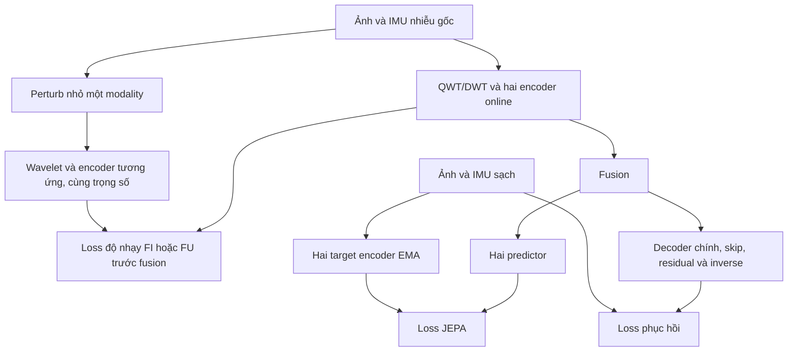
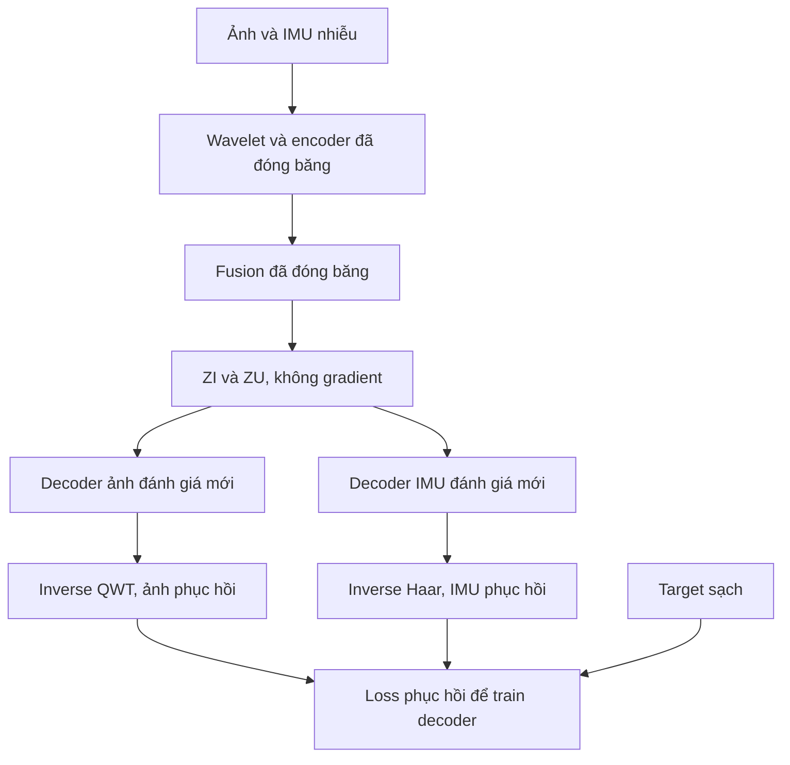

# Sửa source QWT–JEPA: Jacobian tại encoder và đánh giá bằng decoder trên biểu diễn đóng băng

**Phiên bản tài liệu: 2.0 — 14/09/2026**  
**Thay thế:** toàn bộ hướng dẫn migration phiên bản 1.0 về loss độ nhạy tại đầu ra phục hồi.  
**Áp dụng cho:** repository đã build từ `QWT_JEPA_TARTANAIR_RGB256_IMU_ARCHITECTURE.md`, đầu vào một ảnh RGB 256×256 và IMU 128×6.  
**Mục tiêu mới:** học biểu diễn ít nhạy với nhiễu bằng JEPA kết hợp regularization Jacobian tại encoder; sau đó kiểm tra thông tin còn giữ trong biểu diễn bằng decoder đánh giá riêng.

> Tài liệu này là chỉ dẫn sửa source hiện có. Người viết chưa được cung cấp repository, checkpoint hoặc kết quả train thật. Tên API/module là hợp đồng để Agent ánh xạ vào code; không phải xác nhận source đã có các hàm đó. Không được hứa trước model hội tụ, ảnh sắc nét hoặc IMU chính xác.

## 0. Quyết định bắt buộc và khác biệt với bản 1.0

**Chốt vị trí loss Jacobian:** đầu ra dense cuối của **hai encoder online**, trước fusion và trước predictor JEPA. Không đặt loss này tại target encoder, vector pooled, đầu ra predictor hoặc decoder trong cấu hình chính.

| Nội dung | Bản migration 1.0 | Bản 2.0 này |
| --- | --- | --- |
| Target regularization | Ảnh/IMU sau decoder + inverse | Dense features của encoder ảnh/IMU trước fusion |
| Extra forward khi train | Toàn model phục hồi | Chỉ wavelet + encoder của modality được perturb |
| Gradient trực tiếp từ loss độ nhạy | Có thể tới encoder, fusion, decoder | Chỉ encoder được perturb; transform là cố định |
| Độ nhạy output phục hồi | Self gain dùng loss | Chỉ diagnostic, không gradient/loss train |
| Teacher | EMA theo loss JEPA | Giữ nguyên; không regularize teacher |
| Decoder phục hồi chính | Có skip và residual hệ số | Giữ nguyên để phục hồi end-to-end |
| Decoder kiểm tra biểu diễn | Chưa có | Thêm decoder riêng; backbone đóng băng; không lấy skip/input coefficients |
| Cách kết luận | Chủ yếu chất lượng phục hồi | Tách độ ổn định latent, thông tin giải mã được và chất lượng toàn hệ thống |

Các ràng buộc chính:

1. Giữ một frame RGB256, IMU128×6, timestamp pairing và toàn bộ split/normalization của baseline.
2. Giữ QWT ảnh, Haar DWT1D IMU, CNN riêng, fusion, hai predictor/teacher và hai decoder phục hồi chính.
3. Main regularizer dùng **finite difference**, thêm perturbation ở dữ liệu trước wavelet, rồi so đặc trưng encoder. Đây là xấp xỉ độ nhạy theo hướng, không materialize full Jacobian.
4. Tính loss trên LayerNorm **không affine** của dense feature theo channel, chỉ trong nhánh đo; không thay feature thật được gửi vào fusion/decoder.
5. Giữ loss phục hồi khi học representation để hỗ trợ bảo toàn thông tin. Đây tiếp tục là thiết kế restoration + JEPA-inspired, không phải masked I-JEPA gốc hoặc hoàn toàn không có target sạch.
6. Đóng băng encoder/fusion để train **decoder đánh giá mới**; không tiếp tục huấn luyện backbone trong giai đoạn này.
7. Không gộp thêm Hamilton layers, masking, attention, loss biên hay penalty chéo trong cùng main treatment.
8. Mọi thay đổi mới phải có feature flag; không diễn giải lại config v1 thành v2 âm thầm.

Hướng dẫn này ưu tiên đối với phần Jacobian và decoder đánh giá. Các yêu cầu dữ liệu, QWT/IMU, phục hồi, JEPA/EMA và metrics không bị thay thế tiếp tục theo đặc tả kiến trúc gốc.

## 1. Hợp đồng dữ liệu và shape giữ nguyên

| Thành phần | Shape/quy tắc |
| --- | --- |
| Ảnh lưu | `[256,256,3]`, RGB |
| IMU một window lưu | `[128,6]`, cột `ax,ay,az,gx,gy,gz` |
| Ảnh vào model | `[B,3,256,256]`, FP32 trong `[0,1]` |
| IMU vào core | `[B,6,128]`, đã chuẩn hóa bằng thống kê train cố định |
| Public IMU physical | `[B,6,128]`, accel m/s², gyro rad/s; normalize đúng một lần |
| Timestamp ảnh/IMU | `[B]` và `[B,128]`, lưu riêng |
| QWT ảnh tham chiếu | `[B,48,Hc,Wc]`; thường Hc=Wc=128 nếu backend đáp ứng layout |
| Haar IMU | `[B,12,64]` |
| `FI` trước fusion | `[B,128,Hi,Wi]`, tham chiếu Hi=Wi=16 |
| `FU` trước fusion | `[B,128,8]` |
| `ZI`, `ZU` sau fusion | Shape như FI/FU tương ứng |
| Ảnh phục hồi | `[B,3,256,256]` |
| IMU phục hồi | `[B,6,128]`; export một window `[128,6]` |

`FI/FU` là đầu ra dense cuối encoder, trước pooling/fusion. `ZI/ZU` là đầu ra fusion. Không dùng lẫn các tensor này. Không thay 128 hàng thời gian bằng chiều embedding 128.

Data pipeline vẫn phải:

- Split train/validation/test theo trajectory, giữ mọi camera của một trajectory trong cùng split.
- Ghép ảnh và window IMU theo timestamp; centered offline, không nối hai trajectory.
- Shuffle cặp ảnh–IMU khi train; không shuffle hàng IMU hoặc hai modality độc lập.
- Tính normalization trên unique train-clean timestamps; không fit trên validation/test hoặc từng window.
- Audit tần suất thật. Camera 10 Hz/IMU 100 Hz là giả định cần xác minh; nếu IMU100 Hz thì 128 hàng trải dài 1,27 giây.
- Giữ noise realization gốc theo trajectory như baseline. Perturbation độ nhạy không ghi đè trace corruption đó.

## 2. Audit source và lựa chọn điểm bắt đầu

Đọc hướng dẫn repository, xem trạng thái git và những thay đổi người dùng đang có. Dùng `rg` để tìm encoder, fusion, decoder, predictor, EMA, normalization, corruption, trainer, checkpoint và evaluation. Không reset/ghi đè thay đổi không thuộc nhiệm vụ.

Tạo `MIGRATION_V2_AUDIT.md`:

| Hạng mục | File/hàm thật | Trạng thái | Bằng chứng | Việc phải sửa |
| --- | --- | --- | --- | --- |
| API/shape/data | Điền từ repo | PASS/FAIL/UNKNOWN | Log/test | Điền |
| FI/FU trước fusion | Điền | PASS/FAIL/UNKNOWN | Forward trace | Điền |
| QWT/Hamilton | Điền | PASS/FAIL/UNKNOWN | Backend/reference | Điền |
| Loss output v1 | Điền hoặc chưa có | ENABLED/DISABLED/ABSENT | Config và graph | Điền |
| JEPA/EMA | Điền | PASS/FAIL/UNKNOWN | Gradient/counter | Điền |
| Parent checkpoint | Điền hoặc chưa có | VALID/INVALID/ABSENT | Hash/stage | Điền |

Xử lý theo trạng thái:

- **Chưa implement migration v1:** thêm v2 trực tiếp; không cần xây output regularizer trước.
- **Đã implement nhưng chưa train v1:** giữ helper output gain cho diagnostic; tắt output loss ở main v2, thêm encoder loss.
- **Đã train v1:** ưu tiên parent Stage B trước output regularization. Nếu chỉ còn checkpoint v1, có thể tạo cả control và treatment từ cùng checkpoint đó, nhưng báo đây là thí nghiệm tiếp tục từ lịch sử output regularization, không cô lập được tác động lịch sử v1.
- **Mới có source, chưa train:** chạy gate cũ, Stage A phục hồi và Stage B JEPA trước phase so sánh v2.
- **Có lỗi nền:** sửa/audit riêng, tạo baseline hợp lệ rồi mới so sánh v2. Không quy cải thiện do sửa bug cho Jacobian.

Nếu không có source/dataset/GPU thì hoàn thành phần khả thi, ghi `NOT_RUN`; không dùng dữ liệu toy để báo chất lượng TartanAir.

## 3. QWT, Hamilton và phạm vi không thay đổi

QWT trong dự án liên quan đến quaternion của Hamilton. Tuy nhiên, QWT pack hệ số vào CNN số thực không tự khiến các lớp học dùng Hamilton product.

Agent phải xác minh riêng:

1. Filter bank và reference có đúng QWT không? Layout/boundary/inverse và gradient đã pass chưa?
2. Có lớp học dùng Hamilton product không? Nếu có, ở đâu, thứ tự component và thứ tự nhân thế nào?
3. Nếu không có, ghi `learned_hamilton_layers=false`; không đổi tên `Conv2d` thường thành quaternion convolution.

Giữ layout tham chiếu `RGB × band_group × quaternion_component`; không ép mọi backend thành 48 kênh bằng crop/reshape sai. Không coi hệ số QWT là unit quaternion hướng quay và tự normalize norm=1.

Nếu đã có Hamilton layer, giữ implementation được kiểm chứng; test `i⊗j=k`, `j⊗i=-k`, packing và gradient. Jacobian có thể xét trên các thành phần thực. Nếu chưa có lớp Hamilton học được, **không bắt buộc thêm trong migration này**.

IMU vẫn Haar DWT1D theo thời gian; không áp QWT2D lên ma trận thời gian×sensor axes. Với wavelet tuyến tính/filter cố định, Jacobian riêng của wavelet là cố định; loss mới phải phụ thuộc encoder học được.

## 4. Hai sơ đồ riêng: học representation và kiểm tra representation

### 4.1 Học representation



Sơ đồ rút gọn đường skip/residual vào node decoder; chúng tiếp tục tồn tại trong decoder chính. Loss độ nhạy lấy **FI/FU trước fusion**, không lấy output node decoder.

### 4.2 Kiểm tra representation bằng decoder mới



Hai decoder đánh giá chỉ nhận latent tương ứng sau fusion và thông tin layout **tĩnh** cần cho inverse. Không nhận ảnh/IMU gốc, noisy coefficients, skip encoder, target encoder hoặc predictor output. Decoder ảnh đọc ZI, decoder IMU đọc ZU; thông tin cross-modal đã nằm trong fusion.

## 5. API source cần tách

Giữ tên parameter/state dict nếu có thể. Ánh xạ vào các chức năng tương đương:

```python
fi, image_skips, ci, image_layout = model.encode_image(image_rgb)
fu, imu_skips, cu, imu_layout = model.encode_imu_normalized(imu_norm)
zi, zu = model.fuse(fi, fu, time_metadata)

# Decoder chính: như baseline, có skip + residual coefficients.
image_hat, imu_hat_norm = model.decode_restoration(
    zi, zu, image_skips, imu_skips, ci, cu, image_layout, imu_layout,
)

# Helper probe encoder: chỉ modality cần đo, không teacher/fusion/decoder.
fi_perturbed = model.encode_image_dense(image_perturbed)
fu_perturbed = model.encode_imu_dense_normalized(imu_perturbed_norm)
```

`encode_*_dense` phải dùng **cùng instance transform và encoder** như base. Không deepcopy network. Có thể dùng chung `encode_*` và bỏ các return không dùng, nhưng không thay đường tính toán hoặc detach dense feature.

Public adapter normalize IMU physical → core normalized đúng một lần. API core không sinh corruption, không cập nhật EMA/optimizer/counter. Không cho clean target hoặc true noise severity vào feature.

Base forward đã tạo FI/FU để chạy fusion/decoder/JEPA; tái sử dụng tensor còn graph cho loss mới. Extra forward chỉ chạy wavelet+encoder của source được perturb. Không gửi probe vào decoder trong training main v2.

Khi tắt tính năng, output, parameter count và forward cũ phải giữ parity. Những helper mới không thêm parameter học vào backbone. Decoder đánh giá là model/artifact riêng, không nằm trong optimizer backbone.

## 6. Công thức regularization tại encoder

### 6.1 Nơi thêm perturbation và nơi đo

Với dữ liệu core `x_I=I` và `x_U=U_norm`:

```text
f_I = E_I(QWT(x_I))          # FI trước fusion
f_U = E_U(Haar(x_U))         # FU trước fusion
```

Perturb dữ liệu trước wavelet, không perturb tùy ý từng coefficient QWT. Điều này giữ phép đo gắn với nhiễu đầu vào. Dùng thêm một bản x' của **chính sample**, giữ time/target/corruption gốc.

### 6.2 Chuẩn hóa latent chỉ để đo

Với mỗi vị trí không gian/thời gian, chuẩn hóa 128 channels bằng LayerNorm không affine:

```text
h_a = LN_no_affine_channels(f_a, eps=1e-5)
h'_a = LN_no_affine_channels(f'_a, eps=1e-5)
```

- Ảnh normalize theo D=128 tại từng `(h,w)`; IMU tại từng timestep latent.
- Không normalize theo batch, không gộp toàn bộ spatial/time thành một vector và không dùng pooled summary.
- LayerNorm đo có weight/bias học được là không hợp lệ: mạng có thể thu nhỏ affine scale để giảm loss.
- FI/FU gốc vẫn đi vào fusion. Không đưa h thay cho FI/FU nếu chưa làm variant riêng.
- Regularizer này đo Jacobian của **LN∘encoder∘wavelet**, không phải norm Jacobian raw encoder chính xác.

LN không affine hạn chế giảm loss bằng cách co biên độ đều của feature khi variance lớn hơn epsilon. Nó không loại mọi cách làm suy giảm biểu diễn: epsilon, mất đa dạng, thay đổi scale cực nhỏ hoặc thay đổi cấu trúc feature vẫn có thể tạo shortcut. Vì thế mục 8 và decoder đánh giá là bắt buộc.

LN cũng loại độ lệch chung theo channel và giảm ảnh hưởng của biên độ tại từng token. Nhiễu vẫn có thể được truyền qua những thành phần mà phép đo normalized ít thấy. Vì vậy phải log cả độ nhạy raw feature và output diagnostic; không gọi normalized gain nhỏ là toàn bộ encoder đã bất biến với nhiễu.

### 6.3 Probe đầu vào

Mặc định FP32:

```text
epsilon_image = 1/255       # đơn vị RGB [0,1]
epsilon_imu = 0.01          # đơn vị IMU normalized
v = Rademacher(-1,+1), độc lập từng phần tử
x'_I = clamp(x_I + alpha*epsilon_image*v, 0, 1)
x'_U = x_U + alpha*epsilon_imu*v
alpha = 1.0
```

Tính delta thực sau clamp: `delta=x'-x`. Không dùng nominal delta cho ảnh ở biên. IMU không clamp. `0.01 normalized` tương ứng `0.01*train_scale[c]` ở đơn vị physical mỗi kênh; log đủ sáu giá trị. Không lấy scale từ từng window hoặc test.

Alpha sweep diagnostic 0,5/1/2 giữ cùng hướng cho từng sample/draw. Main chỉ thử nhiễu cộng nhỏ; không gọi đây là chống mọi blur, drift hoặc spike lớn. Noise directions cũng có thể chứa biến thiên tín hiệu thật, nên không ép mọi đạo hàm về 0.

### 6.4 Loss từng modality, từng sample

```text
e_a[n] = mean_nonbatch((x'_a[n] - x_a[n])^2)
d_a[n] = mean_nonbatch((h'_a[n] - h_a[n])^2)
g_a[n] = d_a[n] / e_a[n]
L_enc_a = mean_batch(g_a)
L_enc_sens = 0.5 * (L_enc_image + L_enc_imu)
```

Chú ý **denominator mới là actual delta bình phương trong đơn vị core input**, không phải input energy chia epsilon như một số helper output gain v1. Không dùng trực tiếp scale đầu ra ảnh/IMU để normalize latent.

- Mean riêng từng sample rồi lấy ratio; không ratio của mean batch.
- Mean riêng image/IMU để số vị trí ảnh không tự tạo trọng số lớn hơn IMU.
- `e_a > 1e-12` và mọi giá trị hữu hạn; fail rõ nếu mất perturbation do precision. Không âm thầm bỏ sample hoặc che bằng epsilon rồi báo gain=0.
- Scale input ảnh là cường độ `[0,1]`, IMU là độ lệch chuẩn train. Vì hai tọa độ khác nhau, không diễn giải hai gain như cùng một đơn vị vật lý. Cân bằng loss/gradient bằng pilot.
- Trong miền tuyến tính cục bộ, chưa clipping, delta h xấp xỉ `J_h(x) delta x`. Đây là **normalized-latent directional finite-difference sensitivity**, không exact Frobenius norm/spectral norm/Lipschitz bound.

## 7. Loss tổng, lịch source và đường gradient

Giữ mục tiêu cũ:

```text
L_old = L_image_L1 + L_imu_balanced_SmoothL1 + lambda_jepa * L_JEPA
L_total = L_old + lambda_encoder * L_enc_sens
```

Nhánh JEPA vẫn dùng predictor trên ZI/ZU để dự đoán target sạch từ teacher EMA. Không đổi target sang h vừa chuẩn hóa hoặc thêm loss trực tiếp vào teacher.

Tính tiết kiệm:

- Một source cho mỗi optimizer update thành công trong phase v2: `s` chẵn là ảnh, `s` lẻ là IMU.
- Mọi microbatch cùng accumulation group dùng cùng source; chỉ thêm wavelet+encoder của source đó.
- Loss single-source là `L_enc_image` hoặc `L_enc_imu`, không nhân thêm 0,5. Luân phiên đều tối ưu trung bình hai mục tiêu qua các update.
- Có thể cấu hình modality multiplier cố định, mặc định 1/1; nếu thay phải như nhau trong protocol báo cáo và ghi pilot evidence.
- Ramp weight dựa trên số update thành công, không số forward/microbatch.

Gradient của riêng loss mới:

| Module | Gradient trực tiếp từ L_enc_sens? |
| --- | --- |
| Encoder của source bị perturb | Có |
| Encoder còn lại | Không, vì loss đo trước fusion |
| Fusion/predictor/decoder chính | Không |
| Teacher | Không |
| Wavelet/filter cố định | Không có parameter train; vẫn dùng đúng phép biến đổi |

Tổng loss vẫn train fusion/predictor/decoder theo loss cũ. Dù regularizer không có gradient trực tiếp tới fusion, thay đổi encoder qua training có thể ảnh hưởng fusion và output.

Giữ graph qua **cả f và f'**. Không detach base feature. Không `no_grad` quanh perturbed encoder khi train. LN đo không có trainable parameters. Finite difference dùng hai forward bình thường, không cần full Jacobian hoặc higher-order autodiff trong main variant.

Output sensitivity v1 và cross gains không cộng vào loss main v2. Nếu source còn `lambda_output_sensitivity>0`, validator phải từ chối cấu hình main mới hoặc yêu cầu run kết hợp có tên riêng; không tự cộng cả hai.

## 8. Kiểm soát latent collapse và giảm scale giả

Loss độ nhạy nhỏ không chứng minh thông tin hữu ích. Decoder chính có skip/residual nên có thể phục hồi tốt dù dense latent cuối yếu. Teacher EMA và reconstruction cũng không tự bảo đảm tránh mọi collapse.

Trước phase v2, tạo **reference bank train cố định**, mục tiêu >=64 sample đa dạng từ nhiều trajectory nếu có. Không dùng test để xây reference. Lưu ids/seed/corruption và parent checkpoint hash; dùng cùng bank cho control/treatment.

Định kỳ theo dõi FI/FU và hI/hU:

1. Raw norm/RMS và variance theo channel.
2. Std qua **các sample khác nhau tại cùng vị trí/channel**, sau đó tổng hợp mean/median; không chỉ std giữa các pixel/token của một sample.
3. Effective rank và spectrum trên feature pooled per-sample dùng cho diagnostic. Pool chỉ ở diagnostic, không thay vị trí loss.
4. Cosine similarity giữa sample và normalized-feature norms; feature giống nhau trên mọi sample là dấu hiệu cần điều tra.
5. JEPA loss, reconstruction quality, decoder/fusion parameter norms và encoder gain cùng lúc.
6. `raw_feature_fd_gain = mean_nonbatch((f'-f)^2) / e_a` trên cùng perturbation, chỉ diagnostic. So cùng raw RMS/reference parent; raw gain giảm do co scale không tự chứng minh robustness. Không cộng metric raw này vào loss main hoặc so nó trực tiếp với normalized gain.

Cờ cảnh báo pilot: std qua sample hoặc effective rank giảm xuống <10% reference parent qua ba lần đánh giá; raw RMS giảm/tăng hơn 10 lần; hoặc raw channel variance rơi về cỡ epsilon LN trên phần lớn vị trí. Đây là trigger điều tra, không phải định lý collapse. Nếu parent đã có feature gần hằng số, parent không hợp lệ để làm chuẩn.

Khi cờ xuất hiện: kiểm tra feature tap/normalization/gradient/teacher → giảm weight trong run validation riêng → nếu cần thiết kế anti-collapse regularizer như ablation riêng. Không âm thầm thêm variance loss hoặc thay normalize để làm run pass. Main pilot dừng mở rộng khi collapse chưa giải quyết.

Biểu diễn scale cực nhỏ có thể được decoder khuếch đại lại; do đó báo cả raw và normalized statistics. Không so raw gain giữa hai run rồi gọi run nhỏ biên độ hơn là tốt hơn.

## 9. Pseudocode loss encoder

Các helper dưới đây mô tả phép toán. Agent cần kiểm tra trên PyTorch/version và model thật; không coi pseudocode là source đã được kiểm chứng runtime.

```python
import torch
import torch.nn.functional as F


def mean_per_sample(x):
    return x.float().flatten(1).mean(dim=1)


def normalized_dense_for_measurement(f, eps=1e-5):
    # f: B,D,H,W hoặc B,D,T; normalize chỉ D ở từng vị trí.
    if f.ndim not in (3, 4):
        raise ValueError("Expected channel-first dense features")
    q = f.float().movedim(1, -1)
    h = F.layer_norm(q, (q.shape[-1],), weight=None, bias=None, eps=eps)
    return h.movedim(-1, 1)


def make_encoder_probe(x, source, direction, epsilon_image=1.0/255.0,
                       epsilon_imu=0.01, alpha=1.0):
    if source not in ("image", "imu"):
        raise ValueError(source)
    if x.dtype != torch.float32 or not torch.isfinite(x).all():
        raise ValueError("Finite FP32 input required")
    if direction.shape != x.shape or not torch.all(direction.abs() == 1):
        raise ValueError("Direction must be Rademacher with input shape")
    epsilon = epsilon_image if source == "image" else epsilon_imu
    if epsilon <= 0 or alpha <= 0:
        raise ValueError("Invalid probe amplitude")
    if source == "image" and (x.min() < 0 or x.max() > 1):
        raise ValueError("Image outside [0,1]")
    with torch.no_grad():
        proposed = x + alpha * epsilon * direction
        xp = proposed.clamp(0, 1) if source == "image" else proposed
        energy = mean_per_sample((xp - x).square())
        if not torch.isfinite(energy).all() or (energy <= 1e-12).any():
            raise ValueError("Perturbation lost or invalid")
        clipped = (proposed != xp).float().mean()
    return xp, energy, clipped


def encoder_fd_loss(f_base, f_probe, actual_input_energy, ln_eps=1e-5):
    if f_base.shape != f_probe.shape:
        raise ValueError("Encoder feature shape mismatch")
    h_base = normalized_dense_for_measurement(f_base, ln_eps)
    h_probe = normalized_dense_for_measurement(f_probe, ln_eps)
    numerator = mean_per_sample((h_probe - h_base).square())
    gain = numerator / actual_input_energy
    if not torch.isfinite(gain).all():
        raise FloatingPointError("Non-finite encoder sensitivity")
    # Không detach loss. Chỉ detach bản dùng để log.
    return gain.mean(), gain.detach()
```

`direction` tạo bằng seed stream riêng trên đúng device, không gradient. Không để helper thay x hoặc target in-place. Feature raw base và probe phải có graph tới cùng encoder.

### 9.1 Một microbatch trong phase v2

```python
# Pseudocode: helpers khác ánh xạ vào repository thật.
u_norm = normalizer.normalize(batch.imu_bad_phys)
base = model.forward_online_with_features(
    batch.image_bad, u_norm, batch.image_time, batch.imu_times,
)
# base phải chứa FI/FU trước fusion, ZI/ZU và outputs phục hồi như cũ.
loss = restoration_and_jepa_loss(base, batch, teachers, cfg)

if cfg.encoder_sensitivity.enabled and lambda_encoder > 0:
    source = "image" if successful_encoder_updates % 2 == 0 else "imu"
    x = batch.image_bad if source == "image" else u_norm
    v = seeded_rademacher_per_sample(x, batch.sample_ids, probe_seed_context)
    xp, energy, clipped = make_encoder_probe(
        x, source, v,
        epsilon_image=cfg.encoder_sensitivity.image_epsilon,
        epsilon_imu=cfg.encoder_sensitivity.imu_normalized_epsilon,
        alpha=cfg.encoder_sensitivity.alpha,
    )
    if source == "image":
        f_base = base["FI"]
        f_probe = model.encode_image_dense(xp)
    else:
        f_base = base["FU"]
        f_probe = model.encode_imu_dense_normalized(xp)
    l_enc, gain_log = encoder_fd_loss(
        f_base, f_probe, energy,
        ln_eps=cfg.encoder_sensitivity.layer_norm_eps,
    )
    raw_gain_log = (mean_per_sample((f_probe - f_base).square()) / energy).detach()
    multiplier = cfg.encoder_sensitivity.modality_multipliers[source]
    loss = loss + lambda_encoder * multiplier * l_enc

(loss / actual_accumulation_count).backward()
# Sau accumulation: clip, optimizer step; nếu thành công mới scheduler/EMA/counter.
```

Bản tích hợp phải truyền epsilon/alpha/LN epsilon từ resolved config vào helper, không giữ default Python nếu config đã đổi. Validator kiểm tra mọi option được dùng hoặc giới hạn đúng giá trị hỗ trợ.

## 10. RNG, precision, hiệu năng và resume

- Seed perturbation riêng, không dùng global RNG làm thay đổi corruption/sampler của control/treatment.
- Seed stateless đề xuất: SHA-256 của `(probe_seed, phase_id, successful_update, epoch, realization, sample_id, microbatch_index, source, draw_index)`. Không dùng Python `hash()`.
- Validation/diagnostic dùng namespace và seed cố định riêng, không phụ thuộc step train.
- Giữ corruption trace gốc liên tục theo trajectory. Perturbation là thử nghiệm cục bộ trên sample, không ghi vào dataset hoặc merge output chính.
- Main FP32 cho base/probe encoder và phép trừ latent. Cast output từ BF16 sang FP32 không sửa sai số làm tròn đã có. Chỉ thử AMP sau numerical gate riêng.
- Base/probe cùng mode và cùng phép toán. Giữ GroupNorm/dropout=0 như bản cũ. Nếu source có BatchNorm/dropout/stochastic depth/stateful buffers thì xử lý repeatability trước khi diễn giải gain.
- Không EMA ở extra forward. Counter tăng sau optimizer update thành công; mọi microbatch cùng update dùng cùng source.
- Disabled hoặc weight=0 phải bỏ cả perturbation và extra encoder forward. Không tính rồi nhân 0.
- Đo memory/time thực; extra pass chỉ một encoder, nhưng vẫn giữ graph nên không cam kết overhead cố định.
- Main verified path single-GPU/eager. DDP cần wrapper hỗ trợ nhiều đường forward trong một iteration và test sync; không bypass `.module` để né reducer. Compile/AMP/DDP không được báo hỗ trợ khi chưa test.

Checkpoint backbone phase v2 lưu model/teachers/normalizer, optimizer/scheduler/scaler, resolved configs, parent hash, successful phase counter, RNG/sampler/realization và probe/reference-bank hashes.

Phân biệt `init_from_parent` với `resume`:

- Khởi tạo phase mới: load model+teacher+normalizer từ parent, optimizer/scheduler mới theo cùng policy cho control/treatment.
- Resume phase v2: phục hồi đủ state/counter; không reset optimizer/EMA hoặc source parity.
- Không gọi tiếp tục checkpoint v1 bằng config v2 là exact resume. Đây là phase mới có lý do migration và history rõ.

## 11. Quy trình train backbone có JEPA và encoder sensitivity

1. **Baseline gates:** data, wavelet round-trip/gradient, shape, teacher và overfit nhỏ theo đặc tả gốc.
2. **Stage A:** phục hồi joint với decoder chính, chưa JEPA/sensitivity.
3. **Stage B:** bật JEPA theo lịch cũ; chọn parent checkpoint đã có reconstruction và latent diversity hợp lệ.
4. **Phase v2 control/treatment:** cùng parent; control không sensitivity, treatment bật encoder sensitivity. Cả hai tiếp tục loss JEPA và phục hồi cũ.
5. **Khóa checkpoint backbone để đánh giá:** mặc định lấy `last` sau cùng số update, không chọn bằng sensitivity nhỏ nhất. Nếu dùng rule khác phải chốt trước và giống nhau cho hai run.
6. **Train decoder đánh giá:** theo mục 12–13, không thay đổi backbone đã khóa.

Phase v2 pilot: 1.000 successful updates, LR AdamW 2e-5, cosine + warm-up100, effective batch giữ như baseline. Giữ hệ số JEPA và momentum teacher tại giá trị parent đã resolve trong phase này, giống control/treatment.

```text
s = successful update index trong phase v2, bắt đầu 0
lambda_encoder(s) = weight_max * min((s+1)/ramp_updates, 1)
weight_max ban đầu = 1e-4
ramp_updates = 200
```

Đây là giá trị khởi đầu pilot. Độ lớn loss phụ thuộc backbone và normalize; log norm gradient encoder từ L_old và weighted L_enc trên vài batch debug. Có thể pilot `0,1e-5,1e-4,1e-3` nếu cần, chọn trên validation và khóa trước test. Không tăng regularization vì gain giảm nhưng dữ liệu phục hồi đang xấu đi.

Không tự bật loss encoder ngay từ đầu Stage A. Không bỏ reconstruction để gọi training “thuần JEPA” trong patch này; đó là một thiết kế mục tiêu khác cần xử lý collapse và đánh giá riêng.

## 12. Decoder đánh giá biểu diễn: kiến trúc cụ thể

### 12.1 Mục đích và đầu vào

Tạo `RepresentationProbeDecoder` riêng gồm hai nhánh train được. Nó chỉ nhận ZI/ZU từ **encoder+fusion đã đóng băng**.

Tên “probe decoder” ở đây là decoder dùng để đánh giá, khác với “input perturbation probe”. Đặt class/config rõ để không nhầm hai khái niệm.

Decoder đánh giá bị cấm nhận:

- Ảnh/IMU gốc hoặc noisy wavelet coefficients làm input/residual.
- S0/S1/S2, V0/V1/V2 hoặc bất kỳ encoder skip nào.
- Feature từ teacher/predictor, clean target, true noise severity hoặc sample/trajectory embedding.
- Dynamic layout chứa coefficients/dữ liệu theo sample. Chỉ dùng cấu hình tĩnh filter/boundary/padding/sizes để inverse đúng shape.

Nó được phép dùng convolution/residual block nội bộ của chính decoder; “không skip” ở đây nghĩa là không có đường tắt từ dữ liệu hoặc các tầng encoder trước.

### 12.2 Nhánh ảnh

Với QWT tham chiếu Hc=Wc=128, ZI `[B,128,16,16]`:

| Bước | Phép toán | Output |
| --- | --- | --- |
| P2 | Upsample tới32×32 → ConvBlock2D(128,96) → ResBlock2D(96) | `[B,96,32,32]` |
| P1 | Upsample tới64×64 → ConvBlock2D(96,64) → ResBlock2D(64) | `[B,64,64,64]` |
| P0 | Upsample tới128×128 → ConvBlock2D(64,32) → ResBlock2D(32) | `[B,32,128,128]` |
| Head | Conv2D(32,Ccoeff,3,padding=1), linear | `[B,Ccoeff,Hc,Wc]` |
| Synthesis | Inverse QWT của **hệ số tuyệt đối dự đoán** | `[B,3,256,256]` |

`Ccoeff=48` chỉ khi backend/layout thực đúng như vậy. Với Hc/Wc khác, suy ra lịch size từ metadata kiến trúc cố định: encoder S2 có `ceil(Hc/4)`, S1 `ceil(Hc/2)`, S0 `Hc`, tương tự W; không đọc skip tensor để lấy nội dung hoặc size theo sample. Không resize ảnh sau inverse để che shape sai.

### 12.3 Nhánh IMU

ZU `[B,128,8]`:

| Bước | Phép toán | Output |
| --- | --- | --- |
| P2 | Upsample16 → ConvBlock1D(128,96) → ResBlock1D(96) | `[B,96,16]` |
| P1 | Upsample32 → ConvBlock1D(96,64) → ResBlock1D(64) | `[B,64,32]` |
| P0 | Upsample64 → ConvBlock1D(64,32) → ResBlock1D(32) | `[B,32,64]` |
| Head | Conv1D(32,12,3,padding=1), linear | `[B,12,64]` |
| Synthesis | Inverse Haar của hệ số tuyệt đối | `[B,6,128]` normalized |

Block dùng Conv3 stride1 + GroupNorm8 + SiLU; ResBlock theo bản gốc. Image upsample bilinear, IMU linear, `align_corners=False`. Không concat encoder skips. Không cộng CI_bad/CU_bad. Cả approximation/detail được dự đoán.

Khởi tạo decoder mới bằng cùng một initial state dict cho control/treatment. Kaiming initialization cho conv như baseline, bias=0; head dùng random initialization hữu hạn theo cùng rule, **không copy head/weights decoder phục hồi đã train**. Không giữ zero-init correction head vì đây là absolute-coefficient decoder. Ghi state hash và seed.

### 12.4 Giới hạn diễn giải

Decoder này là nonlinear probe có năng lực hữu hạn. Nó đo thông tin có thể giải mã theo kiến trúc và ngân sách đã chọn, không đo toàn bộ thông tin toán học trong latent. Có thể phục hồi mềm hơn decoder chính vì không có skip/residual; điều đó không tự chứng minh encoder vô dụng.

Nếu latent-only probe kém nhưng decoder chính tốt, báo riêng: đường bypass có thể hỗ trợ chất lượng thực tế; chưa đủ bằng chứng biểu diễn cuối đã giữ thông tin cần thiết. Không suy luận chỉ từ một ảnh đẹp/xấu.

## 13. Train decoder đánh giá và ngăn rò rỉ thông tin

Đối với từng checkpoint backbone đã khóa:

1. Load đúng encoder/fusion/normalizer/transforms; freeze parameters, `.eval()` và xác minh buffers không thay đổi.
2. Không dùng teacher/predictor hoặc decoder chính ở forward của probe.
3. Tạo decoder đánh giá mới từ cùng initialization đã lưu; optimizer mới chỉ chứa parameter của hai probe decoders.
4. Dùng **train split** để học decoder, validation để theo dõi/chọn checkpoint theo rule đã chốt, test chỉ sau khi khóa.
5. Cùng data order, corrupted samples/realizations, effective batch, update count, optimizer, LR và initialization cho control/treatment.
6. Không thêm L_JEPA hoặc L_encoder_sensitivity vào phase decoder. Không cập nhật EMA/backbone.

```python
# Pseudocode: backbone frozen, decoder_probe là model riêng.
backbone.eval()
for p in backbone.parameters():
    p.requires_grad_(False)

for batch in probe_train_loader:
    with torch.no_grad():
        u = normalizer.normalize(batch.imu_bad_phys)
        zi, zu = backbone.encode_and_fuse(
            batch.image_bad, u, batch.image_time, batch.imu_times,
        )
    # Không đặt đoạn decoder bên dưới vào no_grad.
    image_hat, imu_hat_n = decoder_probe(zi, zu)
    loss = image_l1(image_hat, batch.image_clean)
    loss = loss + imu_balanced_smooth_l1(
        imu_hat_n, normalizer.normalize(batch.imu_clean_phys),
    )
    optimizer_probe.zero_grad(set_to_none=True)
    loss.backward()
    optimizer_probe.step()
```

Pseudocode tối giản chưa trình bày accumulation/scheduler; production dùng cùng policy đã resolve cho hai run. Không gọi `parent_model.train()` làm backbone trở lại train mode; tách module wrapper để rõ trạng thái.

Pilot probe decoder: 2.000 successful updates, AdamW2e-4, weight_decay1e-4, batch4/accum2 nếu tài nguyên phù hợp, cosine warm-up200, FP32. Đây là budget thử nghiệm, không khẳng định đủ hội tụ. Nếu learning curve còn giảm mạnh, báo undertraining và chỉ mở rộng **cả hai run cùng budget**.

Lưu `last` và `best_joint_validation` bằng rule quality của bản gốc, không chọn bằng latent sensitivity. Báo cả fixed-budget last để kiểm tra hiệu ứng chọn checkpoint. Giữ parent backbone hash, probe-init hash, optimizer/RNG states và training config trong checkpoint probe.

Nếu cache ZI/ZU để tiết kiệm, cache chỉ từ backbone frozen đúng hash và cùng corruption realization; manifest ghi checkpoint/split/normalizer/realization. Không tái dùng latent từ model control cho treatment. Không cache clean-teacher features làm input. Không cho cache stale hoặc batch label vào decoder.

## 14. YAML v2 và tương thích config/checkpoint cũ

Đây là overlay deep-merge vào base config, không thay toàn bộ YAML kiến trúc. Tên config mới phân biệt với `sensitivity` ở v1.

```yaml
migration_schema_version: 2
experiment_suffix: encoder_fd_v2

encoder_sensitivity:
  enabled: true
  method: finite_difference
  target: online_dense_before_fusion
  feature_keys: {image: FI, imu: FU}
  measurement_normalization: channel_layer_norm_no_affine
  layer_norm_eps: 1.0e-5
  feature_to_fusion: raw_unchanged
  image_epsilon: 0.00392156862745098
  imu_normalized_epsilon: 0.01
  alpha: 1.0
  direction: rademacher
  image_boundary: clamp_and_measure_actual_delta
  input_energy: mean_actual_delta_squared_core_units
  minimum_input_energy: 1.0e-12
  detach_base_feature: false
  source_schedule: alternate_successful_optimizer_update
  modality_multipliers: {image: 1.0, imu: 1.0}
  weight_max: 0.0001
  ramp_updates: 200
  probe_seed: 73129
  precision: fp32
  output_sensitivity_loss_weight: 0.0
  fusion_sensitivity_loss_weight: 0.0

representation_phase:
  name: encoder_sensitivity_finetune_v2
  parent_checkpoint: null
  parent_stage_required: stable_stage_b
  init_mode: weights_teachers_normalizer_from_parent
  reset_optimizer_on_new_phase: true
  optimizer: adamw
  learning_rate: 0.00002
  scheduler: warmup_cosine
  warmup_updates: 100
  minimum_lr: 0.000001
  max_successful_updates: 1000
  preserve_parent_jepa_weight: true
  freeze_teacher_momentum_at_parent_value: true
  validation_every_updates: 100
  backbone_checkpoint_for_probe: last_fixed_budget

latent_monitor:
  enabled: true
  reference_split: train
  reference_checkpoint: parent
  target_bank_samples: 64
  log_raw_and_normalized: true
  compare_same_feature_position_across_samples: true
  collapse_relative_threshold: 0.1
  collapse_consecutive_evaluations: 3
  raw_rms_ratio_warning: [0.1, 10.0]

representation_probe:
  enabled: true
  input: fused_dense_only
  freeze_encoders: true
  freeze_fusion: true
  freeze_normalizer_and_transforms: true
  backbone_eval_mode: true
  encoder_skips: false
  input_coefficient_residual: false
  teacher_features: false
  predictor_features: false
  coefficients: absolute_prediction
  initialization: shared_fresh_state_dict
  initialization_seed: 73131
  feature_channels: 128
  decoder_channels: [96, 64, 32]
  optimizer: adamw
  learning_rate: 0.0002
  weight_decay: 0.0001
  scheduler: warmup_cosine
  warmup_updates: 200
  minimum_lr: 0.000001
  batch_size: 4
  gradient_accumulation: 2
  precision: fp32
  max_successful_updates: 2000
  validation_every_updates: 200
  save_last_and_best_joint_validation: true

sensitivity_diagnostics:
  enabled: true
  train_loss: false
  measure_encoder_features: true
  measure_full_restoration_outputs: true
  output_cross_gains: true
  seed: 73130
  target_bank_samples: 64
  directions_per_source: 4
  alpha_sweep: [0.5, 1.0, 2.0]

hamilton_audit:
  required: true
  replace_learned_layers_in_this_migration: false
```

Validation config:

- Config base cũ không có các section mới → encoder_sensitivity/probe phase mặc định tắt; lịch train cũ không đổi.
- Config v1 đã có `sensitivity.target=restored_outputs` phải được nhận diện là v1 hoặc báo cần migration. Không map nó âm thầm sang encoder target.
- Main v2 không cho output/fusion sensitivity loss weight khác0, detach base, measurement affine, hoặc target sau predictor.
- Namespace v1 đang enabled và v2 enabled cùng lúc phải fail main config; chạy combined ablation cần config/run type riêng.
- Probe evaluation bị cấm `encoder_skips=true`, `input_coefficient_residual=true` hoặc unfrozen backbone. Nếu muốn finetune decoder chính, gọi đúng phase khác, không gắn nhãn representation probe.
- Các option chưa hỗ trợ phải báo lỗi rõ. Không nhận config rồi bỏ qua các trường epsilon/weight/target.
- Chỉ resolve đường dẫn thật, parent hash, QWT layout và normalization sau audit. Null parent không được tự chọn checkpoint ngẫu nhiên.

## 15. Diagnostic output sensitivity: giữ để đánh giá, không train

Có thể tái dùng helper v1 để đo bốn hướng qua **toàn bộ model phục hồi chính** trong eval/no_grad:

- Ảnh input → ảnh restored.
- IMU input → IMU restored.
- Ảnh input → IMU restored.
- IMU input → ảnh restored.

Giữ output raw ảnh và IMU normalized để đo; không clamp output ảnh trước diagnostic. Reference output scales v1: `r_image=1/255`, `r_imu=0.01` trong đơn vị core. Công thức output gain vẫn:

```text
E_in[n] = mean((delta_input[n] / r_input)^2)
E_out[n] = mean(((output_perturbed[n] - output_base[n]) / r_output)^2)
G_input_to_output[n] = E_out[n] / E_in[n]
```

**Output gain này khác đơn vị và công thức normalize latent gain mục 6.** Dùng hai tên/helper/report columns riêng. Identity output gain bằng1; encoder gain sau LN không bắt buộc bằng1 và không so trực tiếp hai metric.

Perturbation output diagnostic đi qua fusion, skips, residual coefficients, decoder và inverse; nó kiểm tra liệu encoder ổn định hơn có thực sự dẫn tới output ổn định hơn hay không. Cross gain bằng0 ở FI/FU độc lập trước fusion là cấu trúc hiển nhiên, không phải thành tích fusion.

Diagnostic lặp cùng bank/seed/direction/alpha cho control/treatment. Báo clipping fraction, mean/median/p95 theo trajectory. Không tiêu thụ RNG training hoặc cập nhật teacher/optimizer. Có thể đo thêm qua backbone+probe decoder nhưng ghi rõ output thuộc hệ thống nào; không gộp với decoder chính.

## 16. Kiểm thử bắt buộc

### G0 — Regression và vị trí feature

- Disabled v2 không extra encoder forward/RNG và không đổi output baseline. FP32 parity mục tiêu `atol=1e-6, rtol=1e-5` trong deterministic setup.
- FI/FU lấy đúng dense output cuối trước fusion; đổi IMU với cùng ảnh không đổi FI và ngược lại.
- Shape B=1/B=2 đúng; loss không dựa vào batch-axis normalization. Không thêm frame/IMU channel.
- Parameter names/count backbone giữ nguyên; probe decoder có checkpoint/optimizer riêng.

### G1 — Toán học FD và normalization

1. Rademacher/alpha đúng; image actual delta sau clamp; IMU không clamp; base/target/time không bị sửa in-place.
2. Denominator encoder bằng `mean(delta^2)` trong core units, không nhầm công thức output gain v1.
3. LN theo channel tại từng vị trí: so helper với reference tính tay trên tensor nhỏ, mean≈0, variance gần1 nếu feature variance lớn hơn eps. Không có affine parameters.
4. Hàm feature h tuyến tính toy chưa LN: ratio FD phù hợp `A delta`; dùng analytic reference, không bắt mọi encoder thật có identity gain1.
5. Hằng số h cho loss0 nhưng collapse monitor phải phát hiện feature giống nhau qua sample.
6. Với phép co feature dương `f'=c*f` và variance đủ lớn, LN khiến gain gần bất biến scale; kiểm tra epsilon effects khi c rất nhỏ và monitor phải báo raw-scale/variance thay đổi. Không tuyên bố bất biến tuyệt đối.
7. Alpha sweep0,5/1/2 trên hàm tuyến tính phù hợp; mạng phi tuyến có thể khác, phải log thay vì ép pass lý thuyết tuyến tính.
8. NaN/Inf, energy quá nhỏ, scale âm, source/shape sai đều fail rõ.

### G2 — Gradient routing

- Một loss encoder riêng có gradient tới source encoder, không tới fusion, predictor, decoder, teacher hoặc encoder còn lại. Clear `.grad` trước test hoặc dùng `autograd.grad(..., allow_unused=True)` để tránh nhầm gradient cũ.
- Toy matrix encoder `f_theta(x)=A(theta)x+b` với nhiều channel khác nhau, qua LN như loss thật: autograd gradient theo theta phải khớp central finite difference của **scalar loss theo tham số**. Perturbation input/direction cố định trong phép so. Test raw toy `a*x` trước LN vẫn có thể dùng để kiểm tra derivative2a, nhưng không áp kỳ vọng2a cho LN-invariant scale parameter.
- Không detach base feature; gradient test phải phát hiện nhánh base bị detach.
- Probe chỉ chạy selected encoder; teacher và decoder không được gọi thêm trong main loss.
- Backward tổng loss vẫn cập nhật các module theo mục tiêu cũ; EMA sau đúng một optimizer update thành công.

### G3 — Probe decoder không rò rỉ và backbone thật sự frozen

- Forward decoder chỉ nhận ZI/ZU; không có raw image/IMU/skips/noisy coefficients trong signature hoặc hidden state.
- Giữ cùng ZI/ZU nhưng thay input gốc trong test harness không đổi output decoder. Permute batch latent thì output permute tương ứng khi deterministic.
- Zero/constant latent cho output giống nhau giữa sample có cùng layout, không vẫn tái hiện từng ảnh gốc nhờ đường bypass.
- Sau một probe optimizer step, hash parameters/buffers backbone, normalizer và transforms không đổi; `.grad is None` ở backbone. Decoder parameters đổi và gradient qua synthesis hữu hạn.
- Teacher/predictor/decoder chính không trong optimizer probe và không có dữ liệu vào probe forward.
- Control/treatment dùng cùng initial probe state hash, topology và budget; không copy decoder train cũ.
- Absolute coefficients được synthesize trực tiếp, không cộng coefficients đầu vào. Test synthetic inverse và shape đúng.

### G4 — Checkpoint, state và compatibility

- Config base, v1, v2 được phân loại rõ; unsupported combined mode fail.
- Accumulation dùng cùng source; scheduler/EMA/counter không tăng khi optimizer skip.
- Resume tại boundary được hỗ trợ cho cùng sample, corruption và perturbation; không tuyên bố resume từng microbatch nếu repo chỉ hỗ trợ epoch boundary.
- Probe checkpoint chỉ gắn đúng frozen-backbone hash; mismatch phải fail.
- QWT/Haar round-trip, packing, inverse gradient và Hamilton audit nếu có tiếp tục pass.

### G5 — Pilot và đánh giá thật

Cả backbone phase và decoder-probe phase phải có control/treatment cùng budget. Không có data/GPU thì `NOT_RUN`, không tạo metrics/checkpoint giả. Gate số học không thay thế bằng chứng quality.

## 17. Protocol đánh giá và cách kết luận

Báo **ba nhóm kết quả tách biệt**:

| Nhóm | Đối tượng | Trả lời câu hỏi |
| --- | --- | --- |
| Latent diagnostics | FI/FU raw và normalized | Độ nhạy giảm có kèm collapse/scale shortcut không? |
| Main restoration | Decoder chính có skip/residual | Toàn hệ thống phục hồi thực tế thế nào? |
| Frozen representation probe | Decoder mới chỉ từ ZI/ZU | Biểu diễn đã khóa giữ thông tin giải mã được thế nào? |

Giữ clean/clean, noisy-image/clean-IMU, clean-image/noisy-IMU và noisy/noisy. Severity/reference noise giống giữa run; test không dùng để chỉnh hyperparameter.

Metrics:

- Ảnh: MAE, PSNR, SSIM theo protocol gốc; panel fixed ROI clean/bad/control/treatment/error. Diagnostic biên là lỗi finite differences so clean, không tự thêm edge loss.
- IMU: merge window theo original indices bằng trọng số overlap cũ; metrics physical từng trục, accel/gyro riêng. Không nhân đôi quan sát do window overlap.
- Thêm MAE của `diff(output)/dt - diff(clean)/dt` trên đoạn liên tục để phát hiện mất biến thiên; không nối qua gap/trajectory.
- Xem peak timing/amplitude trên event/trace cố định; không đánh giá chỉ bằng tín hiệu trông mượt hơn.
- Sensitivity bank mục tiêu64 sample, 4 directions/source, alpha0,5/1/2; dùng cùng directions khi sweep. Báo số sample thật, không lặp để giả đủ64.

Main restoration giữ clean tolerances bản cũ: ảnh MAE<=1/255; accel RMSE<=0,02m/s²; gyro RMSE<=0,001rad/s, trừ khi repo có protocol thay thế đã chốt trước. Probe decoder cũng báo các error này nhưng có thể không đạt do không có skip; không dùng cùng ngưỡng như điều kiện duy nhất để phủ nhận mọi thông tin trong latent.

Kết luận phải phân biệt:

- **Implemented:** code/gates đúng.
- **Stable latent:** normalized sensitivity giảm, không có collapse rõ theo bank/scale diagnostics.
- **More decodable representation:** frozen probe có chất lượng tốt hơn control cùng setup/budget trên held-out; không chỉ nhìn main decoder.
- **Better restoration system:** main output tốt hơn theo metrics, không đánh đổi modality còn lại quá mức.

Không suy luận automatically từ một trạng thái sang trạng thái khác. Nếu main tốt nhưng probe kém, báo đúng; nếu latent stable nhưng cả hai output tệ hơn, regularization chưa có lợi.

Pilot guard cho main output: image PSNR không giảm quá0,1dB, RMSE accel/gyro không tăng quá2% khi control error đủ khác0, clean preservation đạt. Đây là ngưỡng thực nghiệm cần khóa trước test, không sensor specs hay kiểm định thống kê. Báo per-trajectory và uncertainty bằng resample trajectory nếu đủ dữ liệu; một seed/pilot nhỏ chỉ hỗ trợ kết luận sơ bộ.

Với probe decoder, so last cùng update budget và best-validation theo cùng rule; xem learning curves để nhận diện decoder chưa học đủ. Không tăng budget chỉ cho một candidate. Nếu cần kết luận mạnh về JEPA, thêm no-JEPA control cùng budget trong nghiên cứu riêng; encoder regularization control ở đây chỉ cô lập phần Jacobian.

## 18. Ablation tối thiểu, source changes và bàn giao

### 18.1 Run tối thiểu

| Run | Backbone training | Loss encoder sensitivity | Decoder đánh giá |
| --- | --- | --- | --- |
| C-backbone | Cùng parent, JEPA+restoration | Tắt | Chưa train trong phase này |
| T-backbone | Như control, cùng update budget | Bật trước fusion | Chưa train trong phase này |
| C-probe | Freeze C-backbone | Không train backbone | Fresh decoder chỉ latent |
| T-probe | Freeze T-backbone | Không train backbone | Cùng initial decoder/budget với C-probe |

Output-only v1, kết hợp encoder+output, post-fusion regularization và Hamilton layers là ablation khác. Không bắt buộc xây tất cả để hoàn thành main v2. Không dùng parent chưa được train thêm làm control duy nhất.

### 18.2 Bản đồ sửa source

| Nhóm module | Thay đổi v2 |
| --- | --- |
| Config | Namespace encoder_sensitivity và representation_probe, schema2, chặn xung đột v1 |
| Encoder API | Trả FI/FU dense trước fusion, selected-encoder forward dùng chung trọng số |
| Loss | LN non-affine measurement + actual-energy FD; tắt output regularizer main |
| Trainer backbone | Extra một encoder, ramp/counter/EMA đúng, monitor latent |
| Trainer probe | Freeze backbone/fusion, optimizer chỉ decoder mới, tuyệt đối không bypass |
| Decoder mới | Absolute coefficients từ fused dense; không skips/noisy residual |
| Eval | Ba nhóm report riêng, output sensitivity chỉ diagnostic |
| Checkpoint | Migration phase metadata, frozen-backbone/probe-init hashes, strict matching |
| Docs/tests | Diagram mới, gradient routing, probe leakage tests và lệnh thật |

Tên gợi ý: `training/encoder_sensitivity.py`, `models/representation_probe.py`, `training/probe_trainer.py`, `evaluation/representation.py`. Ưu tiên cấu trúc repo hiện có, tránh tạo helper trùng công thức.

### 18.3 Deliverables

1. Patch source trên repo, bảng file/hàm thật thay đổi và lý do.
2. `MIGRATION_V2_AUDIT.md`, audit QWT/Hamilton và parent history.
3. Configs base/control/treatment/probe, resolved configs và lệnh thực tế đã chạy.
4. Targeted tests G0–G4, trạng thái G5 và log gradient/EMA/shape.
5. `ENCODER_SENSITIVITY_REPORT.md`: normalized/raw statistics, sensitivity và main restoration.
6. `REPRESENTATION_PROBE_REPORT.md`: freeze evidence, input restrictions, init hash, budget và quality.
7. Checkpoint thật nếu đã train, cùng metadata/hash; README cách reproduce/resume/export.
8. Danh sách phần chưa chạy/chưa chứng minh và lý do, không điền số ước lượng như số đo.

Bảng kết quả phải có cột `system=main|frozen_probe`, backbone hash, decoder hash, seed, split, update budgets, PSNR/SSIM/MAE, accel/gyro RMSE, edge/delta errors và main-output gains nếu đo. Latent gain ghi riêng theo modality cùng LN epsilon/input units.

## 19. Prompt giao trực tiếp cho Agent và checklist cuối

> Hãy sửa repository hiện có theo `QWT_JEPA_JACOBIAN_MIGRATION_GUIDE.md` phiên bản2.0. Bản này thay thế hướng v1 đặt loss tại output. Giữ một ảnh RGB256×256 và IMU128×6, QWT ảnh/Haar IMU, JEPA/EMA, fusion và decoder phục hồi chính. Tích hợp finite-difference sensitivity tại FI/FU dense cuối hai encoder online trước fusion; perturb đầu vào trước wavelet, đo latent qua LayerNorm không affine, giữ gradient cả base/probe. Output sensitivity chỉ diagnostic. Thêm decoder đánh giá riêng chỉ nhận ZI/ZU từ backbone+fusion frozen; không encoder skips, không noisy coefficient residual, không teacher/predictor features. Chạy control/treatment từ cùng parent và hai probe decoders từ cùng initialization/budget. Audit QWT/Hamilton trung thực, không thay lớp Hamilton đồng thời. Kiểm tra config cũ/v1/v2, gradient routing, collapse/scale, freeze/leakage và resume. Bàn giao patch, configs, tests, lệnh thật và ba nhóm kết quả: latent, main restoration, frozen representation probe. Nếu thiếu dữ liệu/GPU/parent hợp lệ thì ghi phần chưa chạy; không báo train thành công hoặc latent tốt hơn khi chưa có bằng chứng.

Checklist review:

- [ ] Main loss tap là FI/FU trước fusion, không predictor/output.
- [ ] LN chỉ measurement, không affine, không đổi feature gửi vào model.
- [ ] Input delta energy đúng công thức mới, không reuse denominator v1 sai.
- [ ] Hai nhánh feature base/probe đều có graph; loss mới chỉ trực tiếp train source encoder.
- [ ] Loss output/fusion sensitivity main đều0; teacher không nhận gradient.
- [ ] Theo dõi raw-scale và đa dạng latent, không chọn checkpoint chỉ theo gain.
- [ ] Probe decoder mới chỉ nhận fused latent, predicts absolute coefficients.
- [ ] Probe backbone/fusion/normalizer/transforms frozen thật, không gradient/buffer update.
- [ ] C/T có cùng parent, noise/data order/budget; probe initial state giống nhau.
- [ ] Bàn giao rõ khác biệt quality giữa main decoder và latent-only decoder.

## 20. Cơ sở và giới hạn khoa học

- [Contractive Auto-Encoders, ICML2011](https://icml.cc/2011/papers/455_icmlpaper.pdf): cơ sở regularization Jacobian tại encoder; bài gốc dùng reconstruction để giữ thông tin. Bản này thêm normalized measurement, hai modality và JEPA-inspired fusion, không tái lập nguyên thí nghiệm.
- [Robust Learning with Jacobian Regularization](https://arxiv.org/abs/1908.02729): tham khảo kiểm soát độ nhạy và tính toán hiệu quả, không chứng minh sẵn hiệu quả restoration TartanAir.
- [I-JEPA](https://arxiv.org/abs/2301.08243): dự đoán target representation; thiết kế noisy-to-clean có reconstruction này không phải masked I-JEPA gốc.
- [PyTorch Jacobian/JVP/VJP tutorial](https://docs.pytorch.org/tutorials/intermediate/jacobians_hessians.html): tham khảo triển khai autodiff/kiểm chứng trong biến thể tương lai; main v2 dùng finite difference, không yêu cầu nâng PyTorch để dựng full Jacobian.
- [Quaternion Networks](https://arxiv.org/abs/1906.04393): Hamilton product trong lớp học; QWT+real CNN không tự có các lớp này.
- [QUAVE](https://arxiv.org/html/2310.10224v3), [QWT repository](https://github.com/ispamm/QWT): nguồn audit transform, layout, filter và inverse.

Các quyết định normalize latent, scale probe, phase/budget, architecture probe decoder và ngưỡng pilot là **đề xuất cho dự án này**. Chưa có kết quả thực nghiệm tổ hợp trên dữ liệu/source của người dùng. Mục tiêu là tạo thí nghiệm có thể kiểm tra và giải thích, không bảo đảm trước lợi ích nghiên cứu.